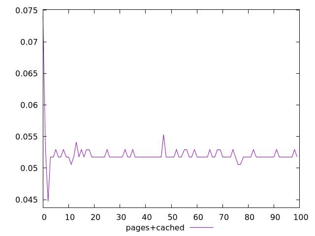
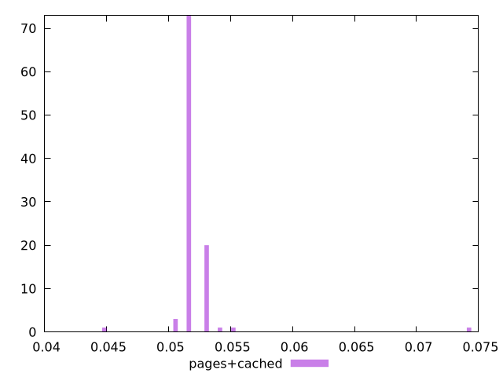
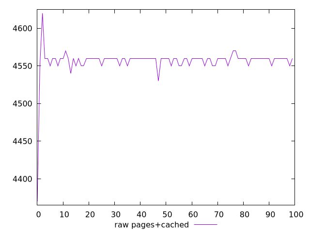
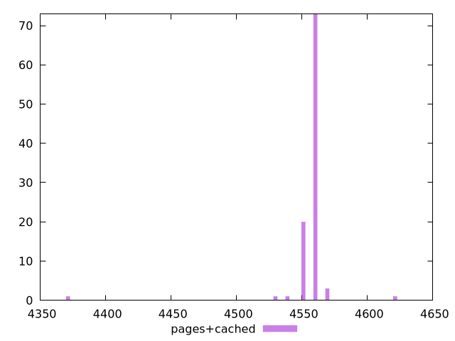

# Report pages+cached

[parent..](./..)  


## Scores

  

## Score Histogram

  

## Score Indicators

```yaml
min: 0.04470588235294115
max: 0.07411764705882351
range: 0.02941176470588236
mean: 0.05217647058823527
median: 0.051764705882352935
stdev: 0.002413198999619529
skewness: 7.24050945999387
eccentricity: 0.5167658463831672
quanta: 7
quantaRatio: 0.07
p90range: 0.0011764705882352788
p90stdev: 0.051764705882352935
p90eccentricity: 0.5167658463831672
p90quanta: 2
p90quantaRatio: 0.022222222222222223
outlandishness: 1.007305221645028

```

## Raw Values

  

## Raw Values Histogram

  

## Raw Indicators

```yaml
min: 4370
max: 4620
range: 250
mean: 4556.5
median: 4560
stdev: 20.512191496766015
skewness: -7.240509459993844
eccentricity: 0.5167658463831901
quanta: 7
quantaRatio: 0.07
p90range: 10
p90stdev: 4560
p90eccentricity: 0.5167658463831901
p90quanta: 2
p90quantaRatio: 0.022222222222222223
outlandishness: 0.9992932044261434

```

<style>
  img {
    max-width: 80%;
  }
</style>
      
