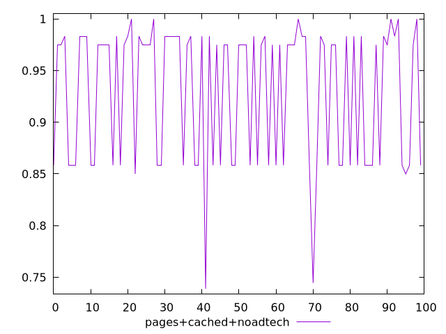
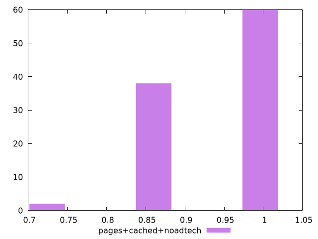
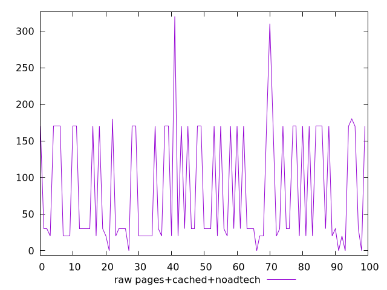
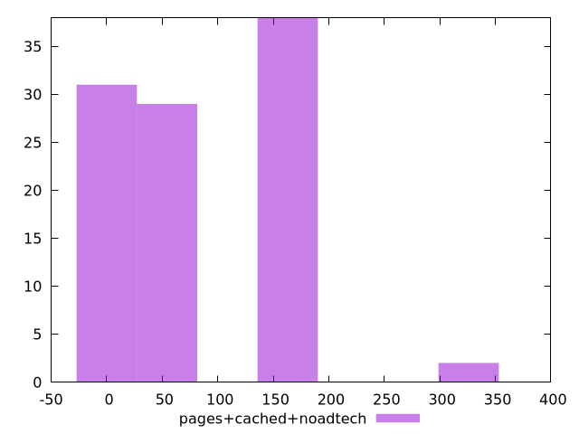

# Report pages+cached+noadtech

[parent..](./..)  


## Scores

  

## Score Histogram

  

## Score Indicators

```yaml
min: 0.7388888888888889
max: 1
range: 0.26111111111111107
mean: 0.9294166666666667
median: 0.975
stdev: 0.06541073339452688
skewness: -0.6575356700028785
eccentricity: 1.6128851417040921
quanta: 7
quantaRatio: 0.07
p90range: 0.1416666666666666
p90stdev: 0.975
p90eccentricity: 1.6128851417040921
p90quanta: 4
p90quantaRatio: 0.044444444444444446
outlandishness: 0.9774164656312428

```

## Raw Values

  

## Raw Values Histogram

  

## Raw Indicators

```yaml
min: 0
max: 320
range: 320
mean: 84.8
median: 30
stdev: 78.78426238786525
skewness: 0.6786950463474659
eccentricity: 1.6094584902724227
quanta: 7
quantaRatio: 0.07
p90range: 170
p90stdev: 30
p90eccentricity: 1.6094584902724227
p90quanta: 4
p90quantaRatio: 0.044444444444444446
outlandishness: 1.3914517843620182

```

<style>
  img {
    max-width: 80%;
  }
</style>
      
