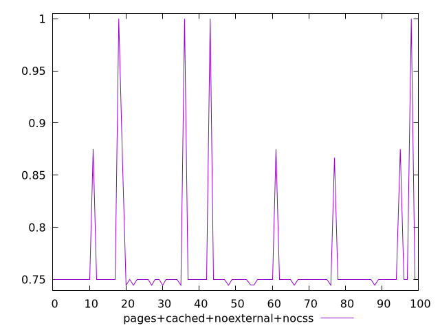
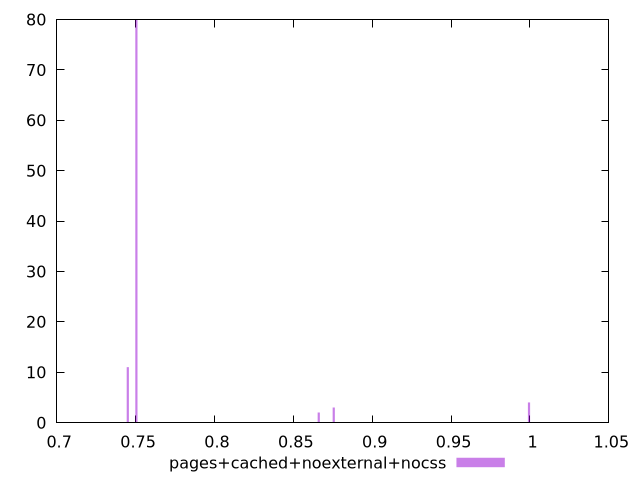
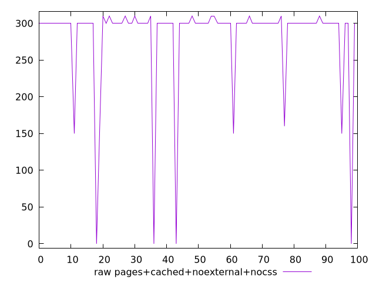
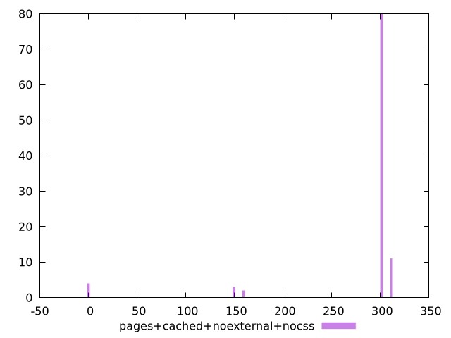

# Report pages+cached+noexternal+nocss

[parent..](./..)  


## Scores

  

## Score Histogram

  

## Score Indicators

```yaml
min: 0.7444444444444445
max: 1
range: 0.25555555555555554
mean: 0.7654722222222224
median: 0.75
stdev: 0.054817676195336784
skewness: 3.4733411482641725
eccentricity: 0.6090898266083187
quanta: 5
quantaRatio: 0.05
p90range: 0.005555555555555536
p90stdev: 0.75
p90eccentricity: 0.6090898266083187
p90quanta: 2
p90quantaRatio: 0.022222222222222223
outlandishness: 1.0434016676833167

```

## Raw Values

  

## Raw Values Histogram

  

## Raw Indicators

```yaml
min: 0
max: 310
range: 310
mean: 281.8
median: 300
stdev: 65.92996283936459
skewness: -3.4637879824999676
eccentricity: 0.6188385104873695
quanta: 5
quantaRatio: 0.05
p90range: 10
p90stdev: 300
p90eccentricity: 0.6188385104873695
p90quanta: 2
p90quantaRatio: 0.022222222222222223
outlandishness: 0.8758473386800292

```

<style>
  img {
    max-width: 80%;
  }
</style>
      
