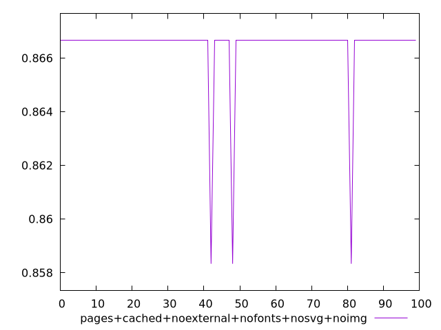
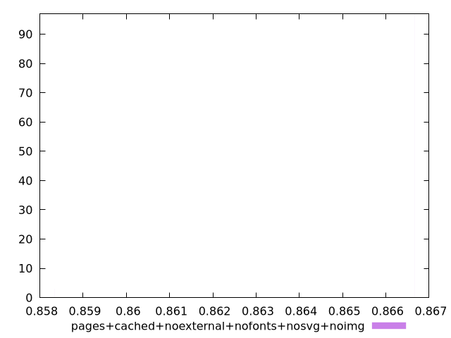
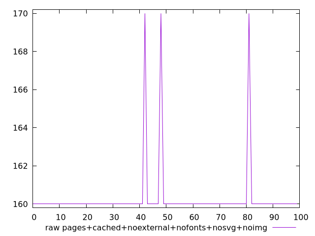
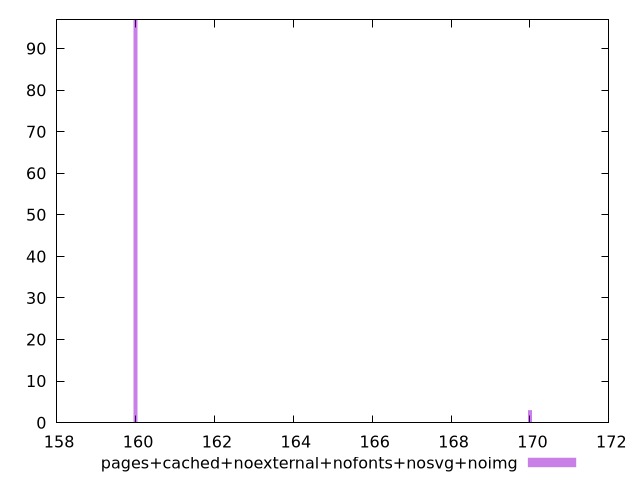

# Report pages+cached+noexternal+nofonts+nosvg+noimg

[parent..](./..)  


## Scores

  

## Score Histogram

  

## Score Indicators

```yaml
min: 0.8583333333333334
max: 0.8666666666666667
range: 0.008333333333333304
mean: 0.8664166666666653
median: 0.8666666666666667
stdev: 0.001421560175769328
skewness: -5.51037758854615
eccentricity: 0.35172622905637013
quanta: 2
quantaRatio: 0.02
p90range: 0
p90stdev: 0.8666666666666667
p90eccentricity: 0.35172622905637013
p90quanta: 1
p90quantaRatio: 0.011111111111111112
outlandishness: 0.999423160133135

```

## Raw Values

  

## Raw Values Histogram

  

## Raw Indicators

```yaml
min: 160
max: 170
range: 10
mean: 160.3
median: 160
stdev: 1.7058722109232007
skewness: 5.51037758854912
eccentricity: 0.3517262290563247
quanta: 2
quantaRatio: 0.02
p90range: 0
p90stdev: 160
p90eccentricity: 0.3517262290563247
p90quanta: 1
p90quantaRatio: 0.011111111111111112
outlandishness: 1.0037535156250001

```

<style>
  img {
    max-width: 80%;
  }
</style>
      
