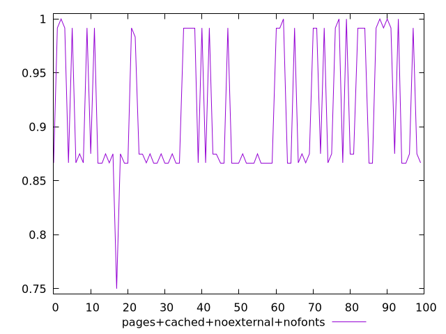
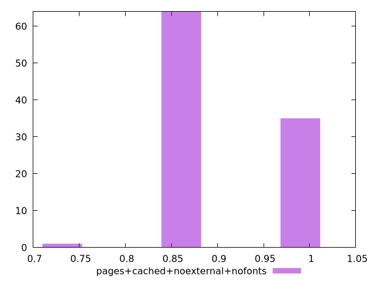
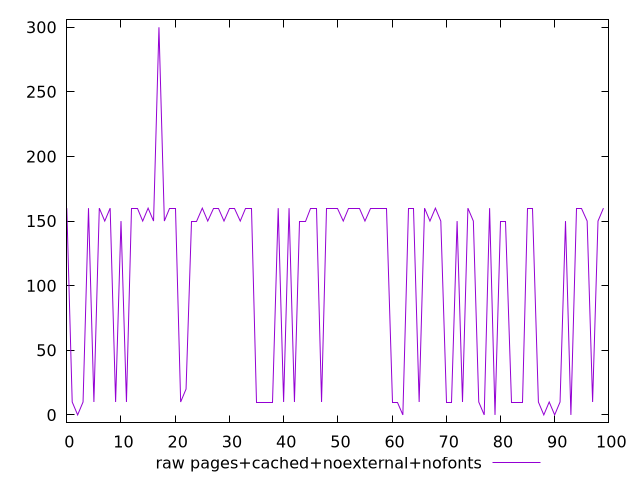
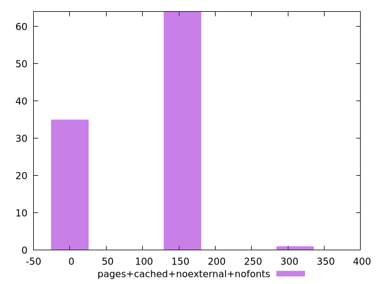

# Report pages+cached+noexternal+nofonts

[parent..](./..)  


## Scores

  

## Score Histogram

  

## Score Indicators

```yaml
min: 0.75
max: 1
range: 0.25
mean: 0.9116666666666656
median: 0.875
stdev: 0.06104415523937481
skewness: 0.4361604560704593
eccentricity: 1.5071057931629444
quanta: 6
quantaRatio: 0.06
p90range: 0.125
p90stdev: 0.875
p90eccentricity: 1.5071057931629444
p90quanta: 4
p90quantaRatio: 0.044444444444444446
outlandishness: 1.0152026582671068

```

## Raw Values

  

## Raw Values Histogram

  

## Raw Indicators

```yaml
min: 0
max: 300
range: 300
mean: 106
median: 150
stdev: 73.25298628724975
skewness: -0.43616045607040754
eccentricity: 1.5071057931629466
quanta: 6
quantaRatio: 0.06
p90range: 150
p90stdev: 150
p90eccentricity: 1.5071057931629466
p90quanta: 4
p90quantaRatio: 0.044444444444444446
outlandishness: 0.8612128874017774

```

<style>
  img {
    max-width: 80%;
  }
</style>
      
