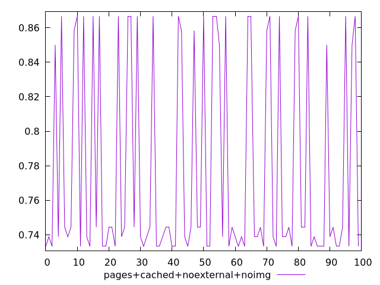
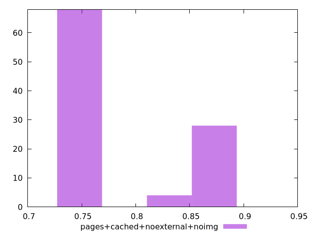
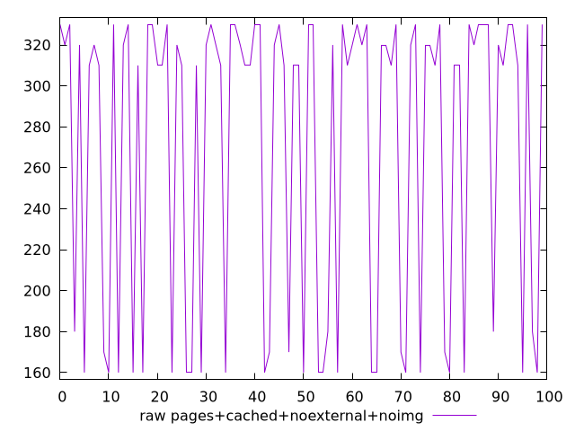
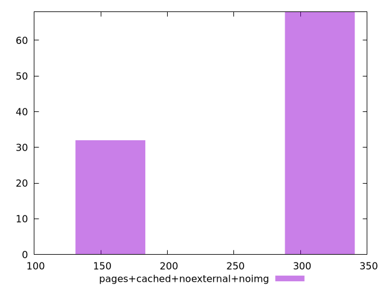

# Report pages+cached+noexternal+noimg

[parent..](./..)  


## Scores

  

## Score Histogram

  

## Score Indicators

```yaml
min: 0.7333333333333333
max: 0.8666666666666667
range: 0.13333333333333341
mean: 0.7781944444444445
median: 0.7444444444444445
stdev: 0.058588562013121945
skewness: 0.7677784159912778
eccentricity: 1.444157497706831
quanta: 6
quantaRatio: 0.06
p90range: 0.13333333333333341
p90stdev: 0.7388888888888889
p90eccentricity: 1.444157497706831
p90quanta: 6
p90quantaRatio: 0.06666666666666667
outlandishness: 1.0257511469844376

```

## Raw Values

  

## Raw Values Histogram

  

## Raw Indicators

```yaml
min: 160
max: 330
range: 170
mean: 271
median: 310
stdev: 73.79024325749306
skewness: -0.7527255528765632
eccentricity: 1.4744496724362248
quanta: 6
quantaRatio: 0.06
p90range: 170
p90stdev: 320
p90eccentricity: 1.4744496724362248
p90quanta: 6
p90quantaRatio: 0.06666666666666667
outlandishness: 0.9148359861591697

```

<style>
  img {
    max-width: 80%;
  }
</style>
      
