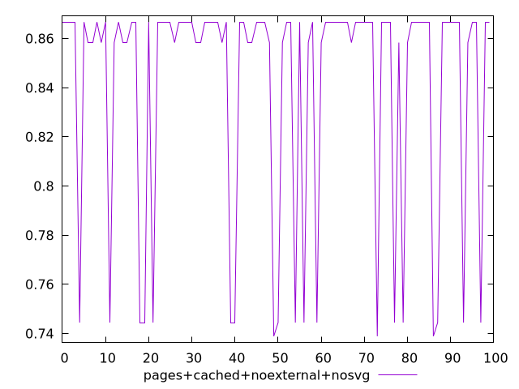
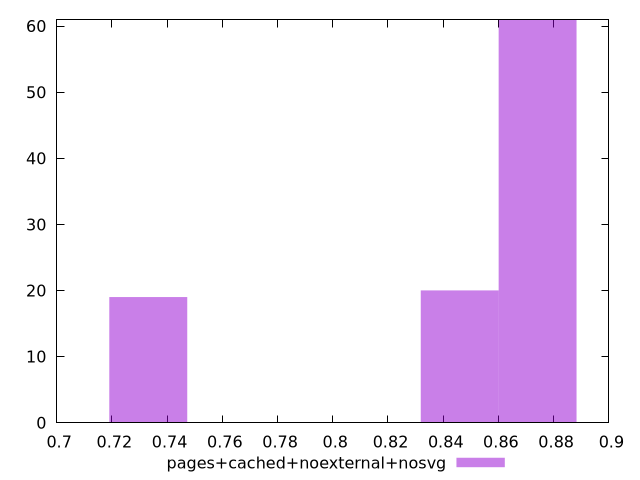
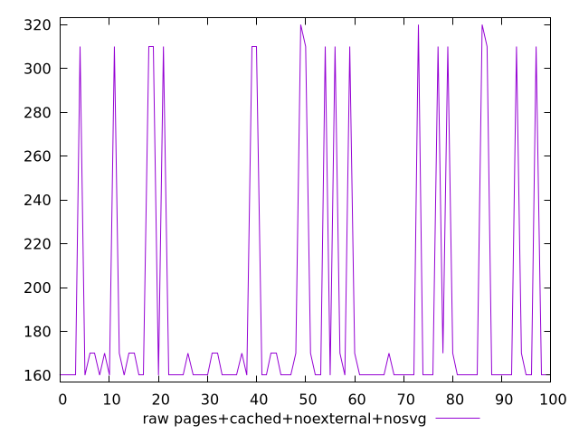
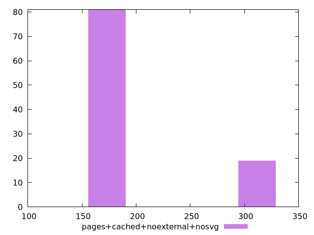

# Report pages+cached+noexternal+nosvg

[parent..](./..)  


## Scores

  

## Score Histogram

  

## Score Indicators

```yaml
min: 0.7388888888888889
max: 0.8666666666666667
range: 0.12777777777777777
mean: 0.8416111111111105
median: 0.8666666666666667
stdev: 0.04760300721904341
skewness: -1.564548785057394
eccentricity: 1.0526879295781977
quanta: 4
quantaRatio: 0.04
p90range: 0.12222222222222223
p90stdev: 0.8666666666666667
p90eccentricity: 1.0526879295781977
p90quanta: 3
p90quantaRatio: 0.03333333333333333
outlandishness: 0.9744056885713401

```

## Raw Values

  

## Raw Values Histogram

  

## Raw Indicators

```yaml
min: 160
max: 320
range: 160
mean: 190.8
median: 160
stdev: 58.646056985956065
skewness: 1.5669674856488656
eccentricity: 1.050368996073364
quanta: 4
quantaRatio: 0.04
p90range: 150
p90stdev: 160
p90eccentricity: 1.050368996073364
p90quanta: 3
p90quantaRatio: 0.03333333333333333
outlandishness: 1.159098609486935

```

<style>
  img {
    max-width: 80%;
  }
</style>
      
