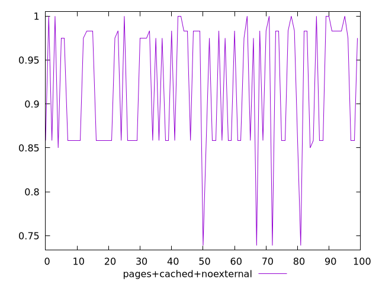
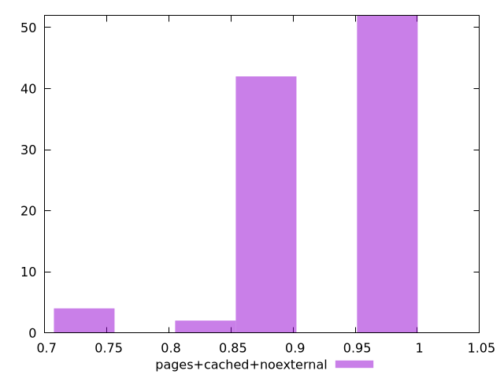
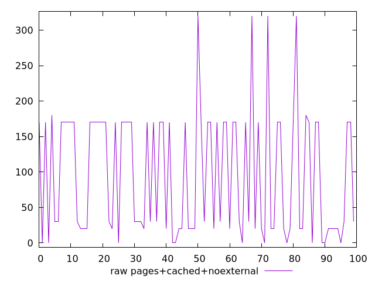
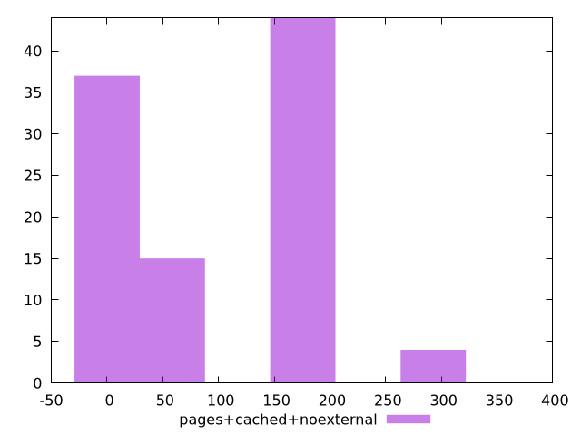

# Report pages+cached+noexternal

[parent..](./..)  


## Scores

  

## Score Histogram

  

## Score Indicators

```yaml
min: 0.7388888888888889
max: 1
range: 0.26111111111111107
mean: 0.9191388888888892
median: 0.975
stdev: 0.07232566843669548
skewness: -0.47460252108062667
eccentricity: 1.8258463199844488
quanta: 6
quantaRatio: 0.06
p90range: 0.15000000000000002
p90stdev: 0.975
p90eccentricity: 1.8258463199844488
p90quanta: 5
p90quantaRatio: 0.05555555555555555
outlandishness: 0.9943224963364772

```

## Raw Values

  

## Raw Values Histogram

  

## Raw Indicators

```yaml
min: 0
max: 320
range: 320
mean: 97.3
median: 30
stdev: 87.46262058731152
skewness: 0.512286561859953
eccentricity: 1.8179194601341122
quanta: 6
quantaRatio: 0.06
p90range: 180
p90stdev: 30
p90eccentricity: 1.8179194601341122
p90quanta: 5
p90quantaRatio: 0.05555555555555555
outlandishness: 1.0739826896817337

```

<style>
  img {
    max-width: 80%;
  }
</style>
      
