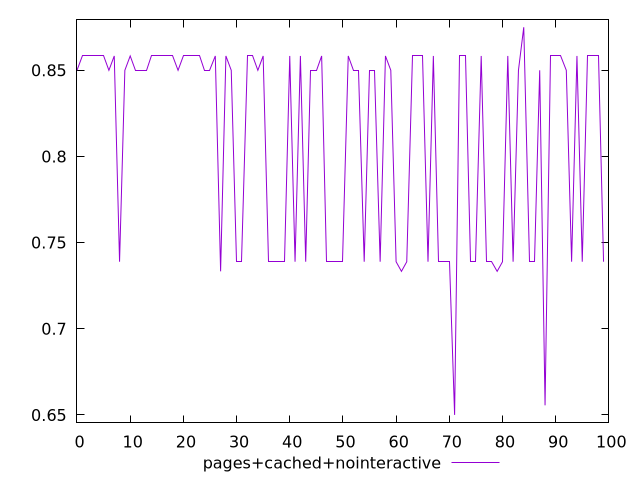
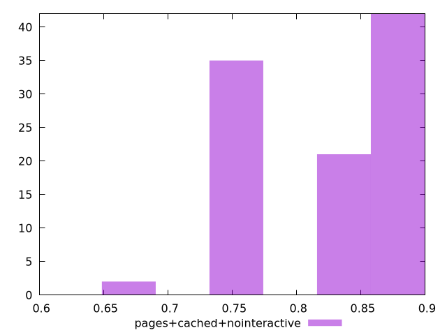
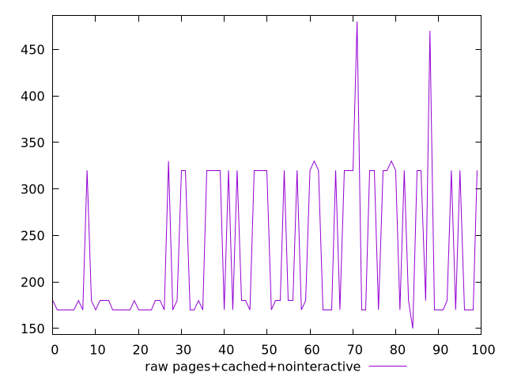
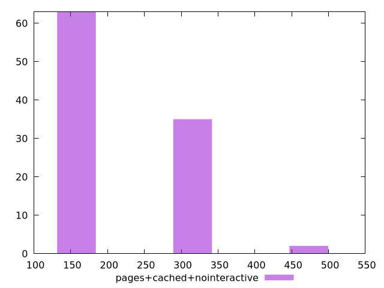

# Report pages+cached+nointeractive

[parent..](./..)  


## Scores

  

## Score Histogram

  

## Score Indicators

```yaml
min: 0.65
max: 0.875
range: 0.22499999999999998
mean: 0.8106666666666663
median: 0.85
stdev: 0.06020505085246706
skewness: -0.6926801346933253
eccentricity: 1.5502575284264601
quanta: 7
quantaRatio: 0.07
p90range: 0.13611111111111107
p90stdev: 0.85
p90eccentricity: 1.5502575284264601
p90quanta: 4
p90quantaRatio: 0.044444444444444446
outlandishness: 0.9756019236533745

```

## Raw Values

  

## Raw Values Histogram

  

## Raw Indicators

```yaml
min: 150
max: 480
range: 330
mean: 230.8
median: 180
stdev: 78.46884732172386
skewness: 0.8756126322466211
eccentricity: 1.519074181264287
quanta: 7
quantaRatio: 0.07
p90range: 170
p90stdev: 180
p90eccentricity: 1.519074181264287
p90quanta: 4
p90quantaRatio: 0.044444444444444446
outlandishness: 1.1300756289227463

```

<style>
  img {
    max-width: 80%;
  }
</style>
      
