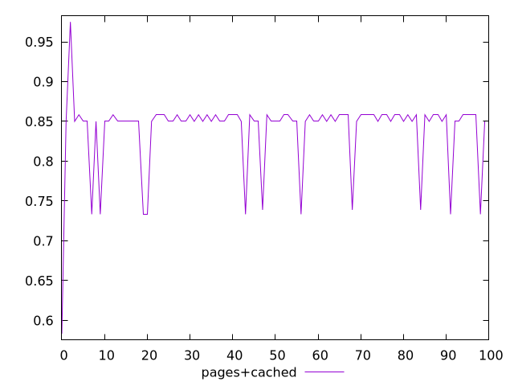
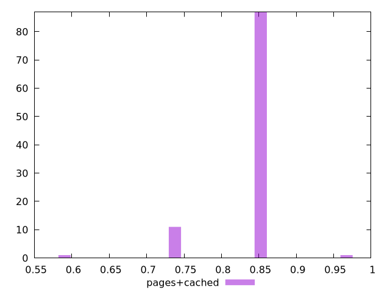
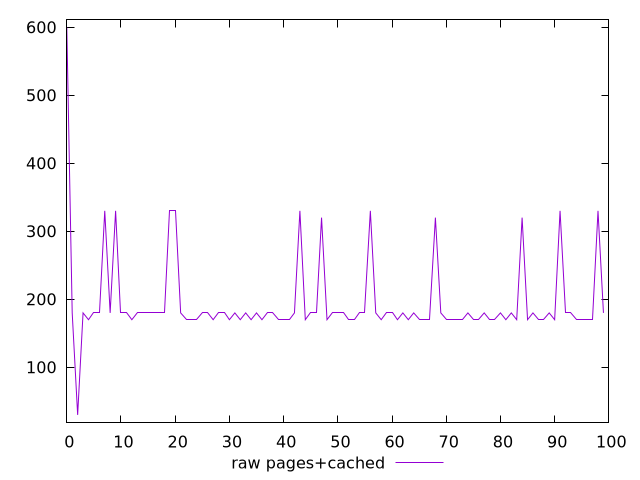
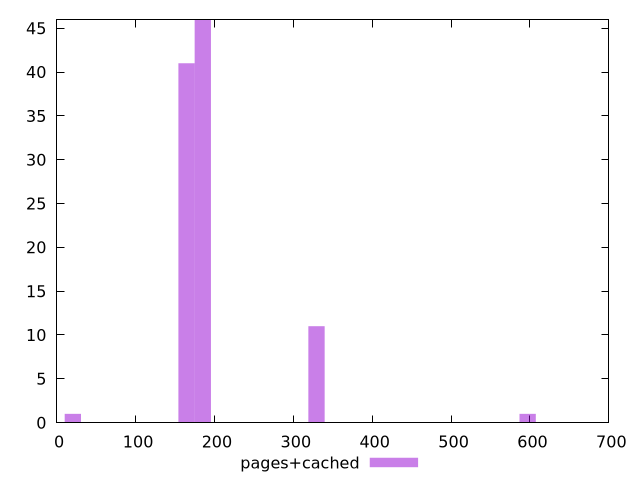

# Report pages+cached

[parent..](./..)  


## Scores

  

## Score Histogram

  

## Score Indicators

```yaml
min: 0.5833333333333334
max: 0.975
range: 0.3916666666666666
mean: 0.839333333333333
median: 0.85
stdev: 0.04734252649378587
skewness: -2.4985010090963558
eccentricity: 0.844906323392999
quanta: 6
quantaRatio: 0.06
p90range: 0.11944444444444446
p90stdev: 0.85
p90eccentricity: 0.844906323392999
p90quanta: 3
p90quantaRatio: 0.03333333333333333
outlandishness: 0.9748470421331202

```

## Raw Values

  

## Raw Values Histogram

  

## Raw Indicators

```yaml
min: 30
max: 600
range: 570
mean: 194.8
median: 180
stdev: 64.79938271310925
skewness: 3.1951351860027906
eccentricity: 0.8024767802221713
quanta: 6
quantaRatio: 0.06
p90range: 150
p90stdev: 180
p90eccentricity: 0.8024767802221713
p90quanta: 3
p90quantaRatio: 0.03333333333333333
outlandishness: 1.1697603439739297

```

<style>
  img {
    max-width: 80%;
  }
</style>
      
