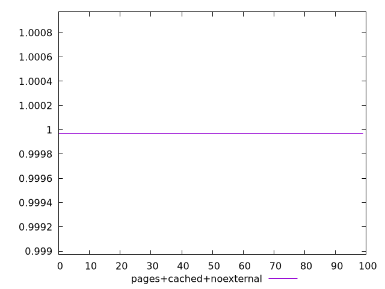
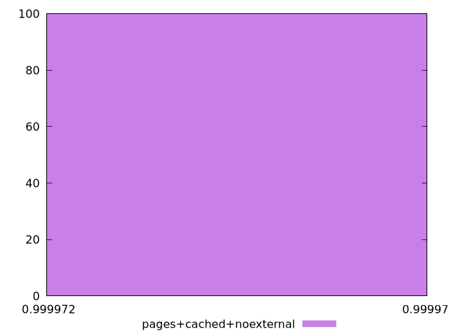
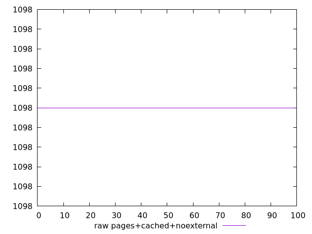
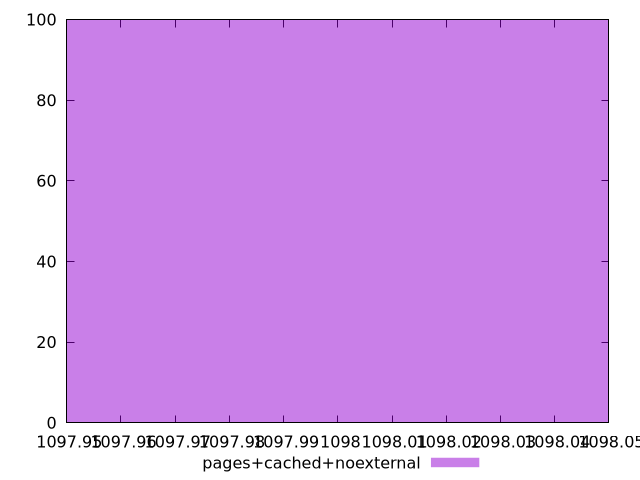

# Report pages+cached+noexternal

[parent..](./..)  


## Scores

  

## Score Histogram

  

## Score Indicators

```yaml
min: 0.999972393989216
max: 0.999972393989216
range: 0
mean: 0.9999723939892149
median: 0.999972393989216
stdev: 1.1102230246251565e-15
skewness: 1
eccentricity: 0
quanta: 1
quantaRatio: 0.01
p90range: 0
p90stdev: 0.999972393989216
p90eccentricity: 0
p90quanta: 1
p90quantaRatio: 0.011111111111111112
outlandishness: 0.9999999999999989

```

## Raw Values

  

## Raw Values Histogram

  

## Raw Indicators

```yaml
min: 1098
max: 1098
range: 0
mean: 1098
median: 1098
stdev: 0
skewness: .nan
eccentricity: .nan
quanta: 1
quantaRatio: 0.01
p90range: 0
p90stdev: 1098
p90eccentricity: .nan
p90quanta: 1
p90quantaRatio: 0.011111111111111112
outlandishness: 1

```

<style>
  img {
    max-width: 80%;
  }
</style>
      
