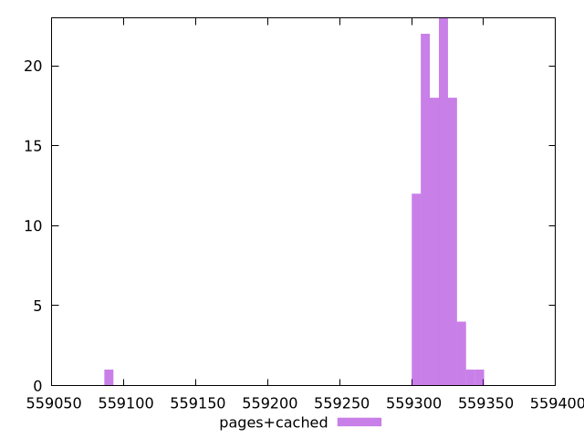

# Report pages+cached

[parent..](./..)  


## Scores

  

## Score Histogram

  

## Score Indicators

```yaml
min: 0.11056405971196986
max: 0.11063672447099693
range: 0.00007266475902706349
mean: 0.11057272727522387
median: 0.11057220675050766
stdev: 0.000006964724527300027
skewness: 7.70309917745538
eccentricity: 0.832625576630283
quanta: 100
quantaRatio: 1
p90range: 0.0000083927235544623
p90stdev: 0.11057253874600256
p90eccentricity: 0.832625576630283
p90quanta: 90
p90quantaRatio: 1
outlandishness: 1.0000049599435403

```

## Raw Values

  

## Raw Values Histogram

  

## Raw Indicators

```yaml
min: 559090.7185985723
max: 559346.0052173185
range: 255.28661874623504
mean: 559315.5428894513
median: 559317.3711670391
stdev: 24.4688081934864
skewness: -7.701629284626827
eccentricity: 0.8328416928494743
quanta: 100
quantaRatio: 1
p90range: 29.49581005575601
p90stdev: 559316.2043793297
p90eccentricity: 0.8328416928494743
p90quanta: 90
p90quantaRatio: 1
outlandishness: 0.9999965574024442

```

<style>
  img {
    max-width: 80%;
  }
</style>
      
