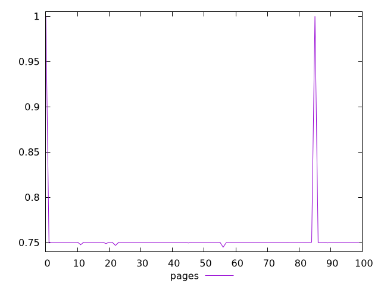
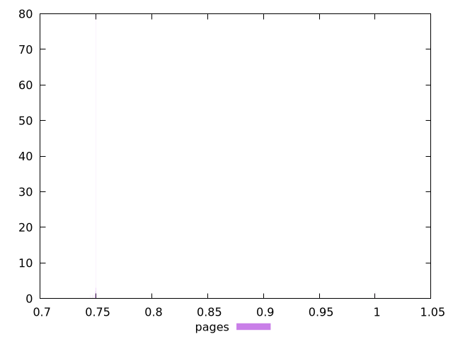
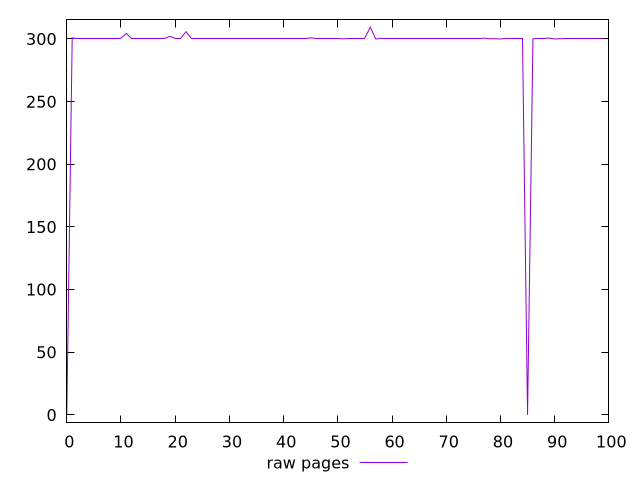
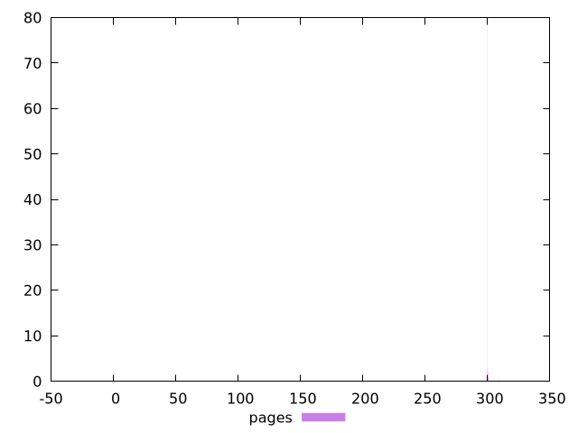

# Report pages

[parent..](./..)  


## Scores

  

## Score Histogram

  

## Score Indicators

```yaml
min: 0.7447911111111111
max: 1
range: 0.25520888888888893
mean: 0.7548498777777779
median: 0.75
stdev: 0.03502774031010241
skewness: 6.853252690199149
eccentricity: 0.29405963254426454
quanta: 20
quantaRatio: 0.2
p90range: 0.00029888888888884857
p90stdev: 0.75
p90eccentricity: 0.29405963254426454
p90quanta: 11
p90quantaRatio: 0.12222222222222222
outlandishness: 1.0130088398789519

```

## Raw Values

  

## Raw Values Histogram

  

## Raw Indicators

```yaml
min: 0
max: 309.376
range: 309.376
mean: 294.27022
median: 300
stdev: 42.055590301309564
skewness: -6.848355070984402
eccentricity: 0.298187230524012
quanta: 20
quantaRatio: 0.2
p90range: 0.5380000000000109
p90stdev: 300
p90eccentricity: 0.298187230524012
p90quanta: 11
p90quantaRatio: 0.12222222222222222
outlandishness: 0.9620208711192916

```

<style>
  img {
    max-width: 80%;
  }
</style>
      
