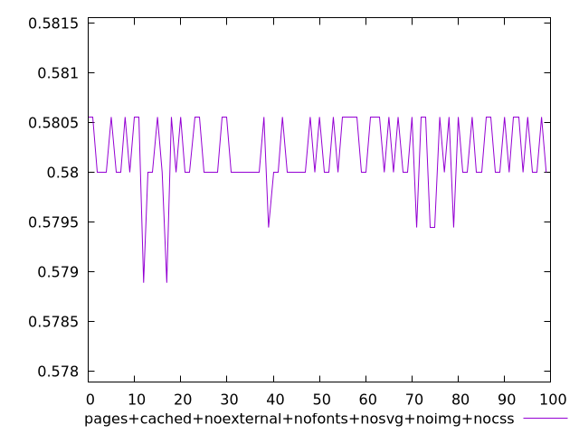
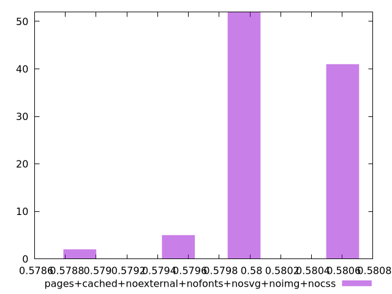
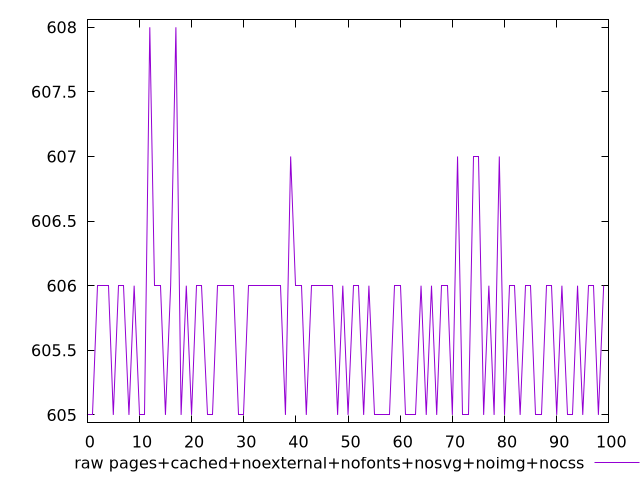
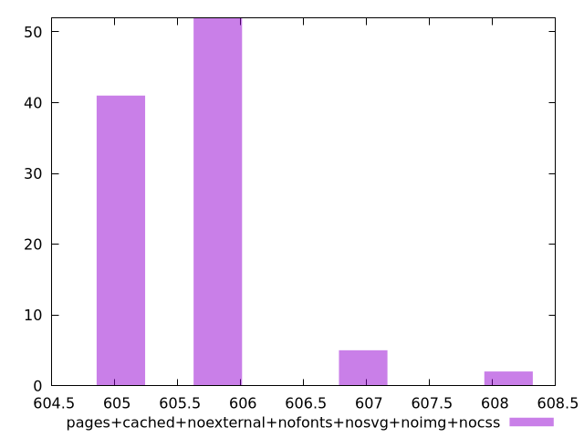

# Report pages+cached+noexternal+nofonts+nosvg+noimg+nocss

[parent..](./..)  


## Scores

  

## Score Histogram

  

## Score Indicators

```yaml
min: 0.5788888888888889
max: 0.5805555555555555
range: 0.0016666666666665941
mean: 0.5801777777777772
median: 0.58
stdev: 0.0003675074535231226
skewness: -0.8735163407363458
eccentricity: 1.5116851378928553
quanta: 4
quantaRatio: 0.04
p90range: 0.0005555555555555314
p90stdev: 0.58
p90eccentricity: 1.5116851378928553
p90quanta: 2
p90quantaRatio: 0.022222222222222223
outlandishness: 0.9998042607336819

```

## Raw Values

  

## Raw Values Histogram

  

## Raw Indicators

```yaml
min: 605
max: 608
range: 3
mean: 605.68
median: 606
stdev: 0.6615134163416487
skewness: 0.8735163407406006
eccentricity: 1.511685137892252
quanta: 4
quantaRatio: 0.04
p90range: 1
p90stdev: 606
p90eccentricity: 1.511685137892252
p90quanta: 2
p90quantaRatio: 0.022222222222222223
outlandishness: 1.0003376307836505

```

<style>
  img {
    max-width: 80%;
  }
</style>
      
