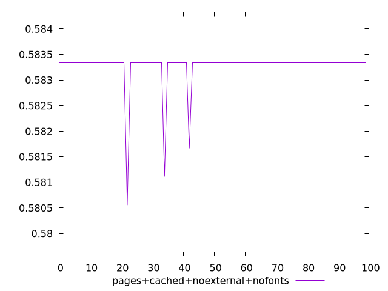
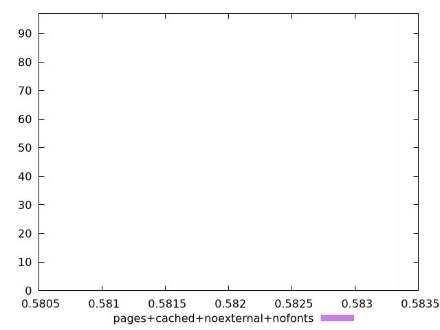
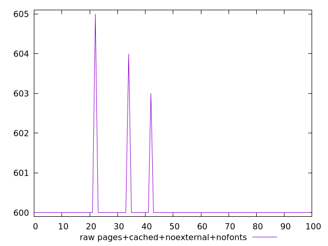
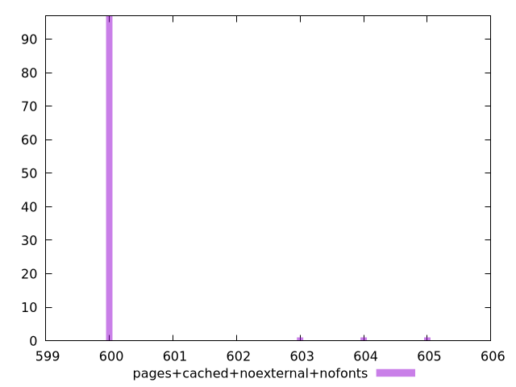

# Report pages+cached+noexternal+nofonts

[parent..](./..)  


## Scores

  

## Score Histogram

  

## Score Indicators

```yaml
min: 0.5805555555555555
max: 0.5833333333333334
range: 0.002777777777777879
mean: 0.5832666666666674
median: 0.5833333333333334
stdev: 0.000387138919781884
skewness: -5.861443102946468
eccentricity: 0.34440694675812855
quanta: 4
quantaRatio: 0.04
p90range: 0
p90stdev: 0.5833333333333334
p90eccentricity: 0.34440694675812855
p90quanta: 1
p90quantaRatio: 0.011111111111111112
outlandishness: 0.9997714416326534

```

## Raw Values

  

## Raw Values Histogram

  

## Raw Indicators

```yaml
min: 600
max: 605
range: 5
mean: 600.12
median: 600
stdev: 0.6968500556073741
skewness: 5.86144310294122
eccentricity: 0.3444069467581876
quanta: 4
quantaRatio: 0.04
p90range: 0
p90stdev: 600
p90eccentricity: 0.3444069467581876
p90quanta: 1
p90quantaRatio: 0.011111111111111112
outlandishness: 1.00040004

```

<style>
  img {
    max-width: 80%;
  }
</style>
      
