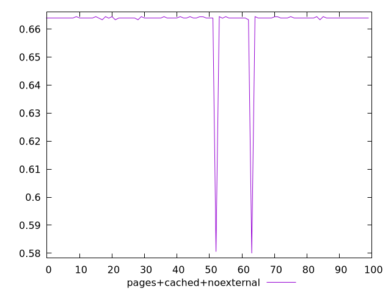
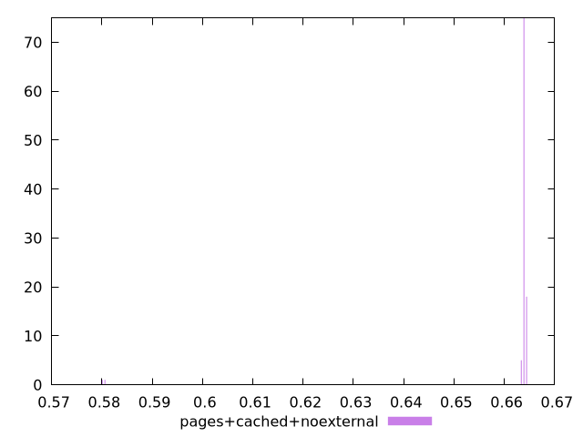
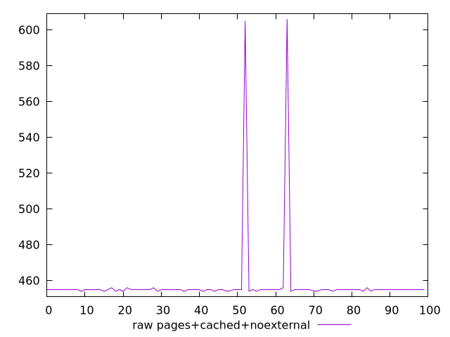
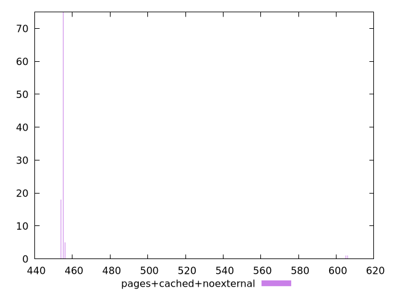

# Report pages+cached+noexternal

[parent..](./..)  


## Scores

  

## Score Histogram

  

## Score Indicators

```yaml
min: 0.58
max: 0.6644444444444444
range: 0.08444444444444443
mean: 0.6622888888888895
median: 0.6638888888888889
stdev: 0.011718740925922426
skewness: -6.852136138388159
eccentricity: 0.3072002378716877
quanta: 5
quantaRatio: 0.05
p90range: 0.0011111111111110628
p90stdev: 0.6638888888888889
p90eccentricity: 0.3072002378716877
p90quanta: 3
p90quantaRatio: 0.03333333333333333
outlandishness: 0.9950931986940853

```

## Raw Values

  

## Raw Values Histogram

  

## Raw Indicators

```yaml
min: 454
max: 606
range: 152
mean: 457.88
median: 455
stdev: 21.09373366666033
skewness: 6.852136138387998
eccentricity: 0.3072002378716848
quanta: 5
quantaRatio: 0.05
p90range: 2
p90stdev: 455
p90eccentricity: 0.3072002378716848
p90quanta: 3
p90quantaRatio: 0.03333333333333333
outlandishness: 1.0129467521285989

```

<style>
  img {
    max-width: 80%;
  }
</style>
      
