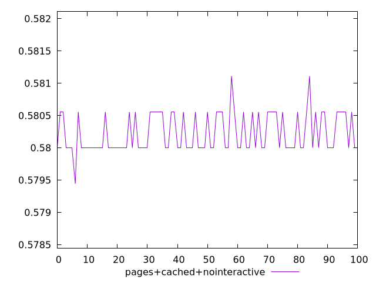
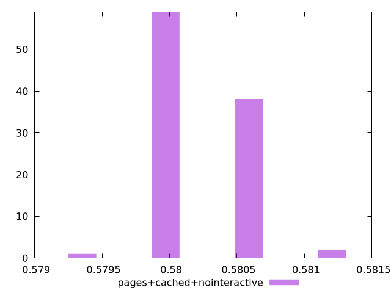
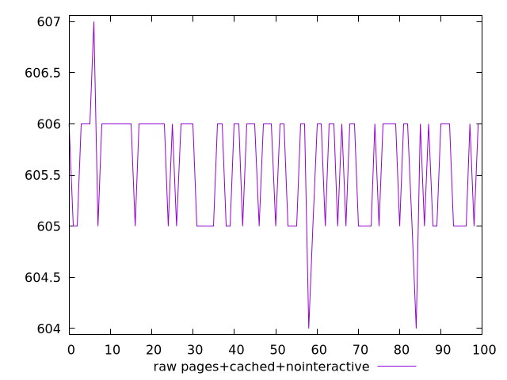
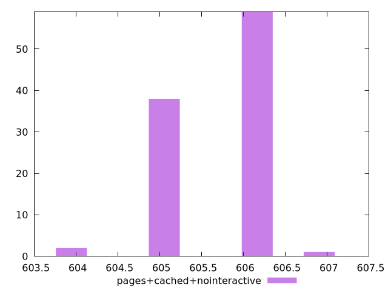

# Report pages+cached+nointeractive

[parent..](./..)  


## Scores

  

## Score Histogram

  

## Score Indicators

```yaml
min: 0.5794444444444444
max: 0.5811111111111111
range: 0.0016666666666667052
mean: 0.580227777777777
median: 0.58
stdev: 0.00030525237484035184
skewness: 0.5410047453893848
eccentricity: 1.565189388053485
quanta: 4
quantaRatio: 0.04
p90range: 0.0005555555555555314
p90stdev: 0.58
p90eccentricity: 1.565189388053485
p90quanta: 2
p90quantaRatio: 0.022222222222222223
outlandishness: 1.0001255478753766

```

## Raw Values

  

## Raw Values Histogram

  

## Raw Indicators

```yaml
min: 604
max: 607
range: 3
mean: 605.59
median: 606
stdev: 0.5494542747126463
skewness: -0.5410047453823481
eccentricity: 1.5651893880519478
quanta: 4
quantaRatio: 0.04
p90range: 1
p90stdev: 606
p90eccentricity: 1.5651893880519478
p90quanta: 2
p90quantaRatio: 0.022222222222222223
outlandishness: 0.9997835337028774

```

<style>
  img {
    max-width: 80%;
  }
</style>
      
