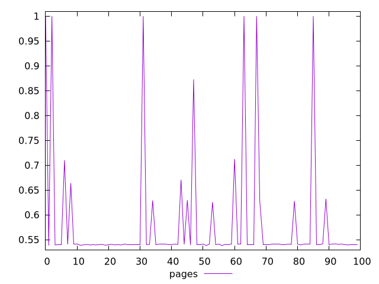
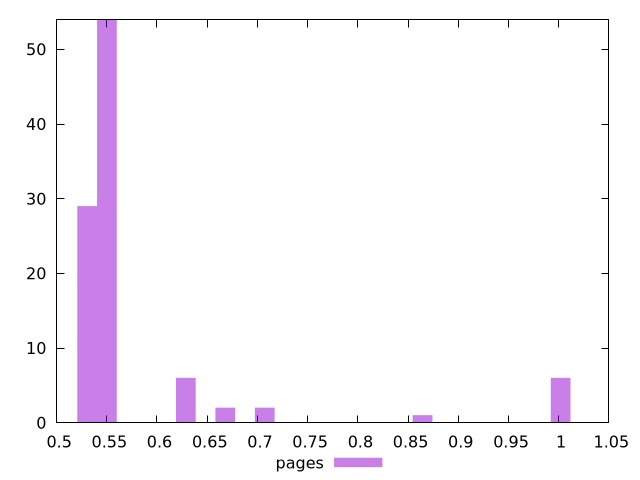
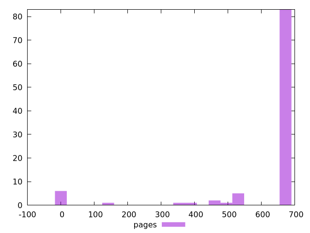

# Report pages

[parent..](./..)  


## Scores

  

## Score Histogram

  

## Score Indicators

```yaml
min: 0.5383333333333333
max: 1
range: 0.46166666666666667
mean: 0.5825361111111111
median: 0.5405555555555556
stdev: 0.11564473491908818
skewness: 2.9791141165326342
eccentricity: 0.7358263608281134
quanta: 18
quantaRatio: 0.18
p90range: 0.12555555555555553
p90stdev: 0.5405555555555556
p90eccentricity: 0.7358263608281134
p90quanta: 13
p90quantaRatio: 0.14444444444444443
outlandishness: 1.1314684734179765

```

## Raw Values

  

## Raw Values Histogram

  

## Raw Indicators

```yaml
min: 0
max: 681
range: 681
mean: 611.17
median: 677
stdev: 174.2038492686083
skewness: -2.8058293049277183
eccentricity: 0.7674916516560165
quanta: 18
quantaRatio: 0.18
p90range: 226
p90stdev: 677
p90eccentricity: 0.7674916516560165
p90quanta: 13
p90quantaRatio: 0.14444444444444443
outlandishness: 0.846608694550888

```

<style>
  img {
    max-width: 80%;
  }
</style>
      
