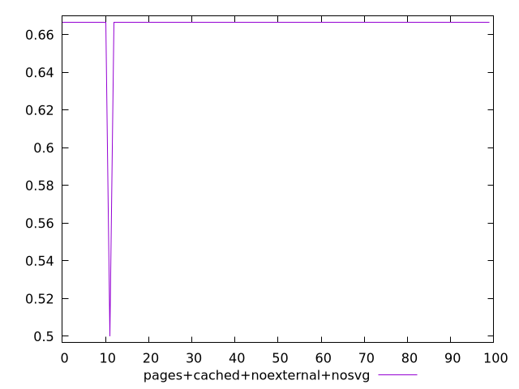
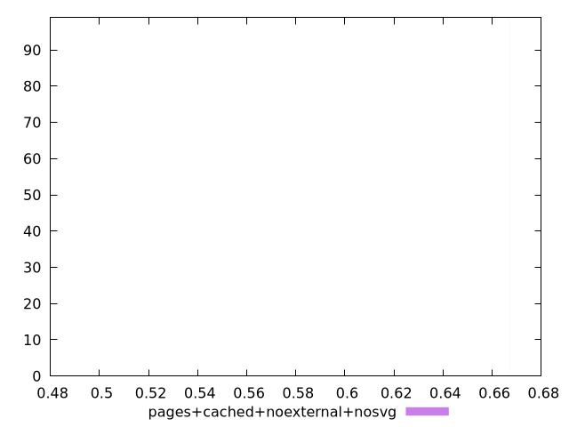
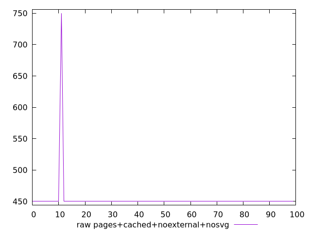
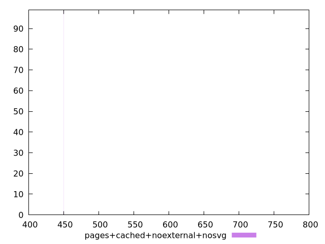

# Report pages+cached+noexternal+nosvg

[parent..](./..)  


## Scores

  

## Score Histogram

  

## Score Indicators

```yaml
min: 0.5
max: 0.6666666666666666
range: 0.16666666666666663
mean: 0.6649999999999993
median: 0.6666666666666666
stdev: 0.016583123951776992
skewness: -9.849370589540186
eccentricity: 0.2010075630518404
quanta: 2
quantaRatio: 0.02
p90range: 0
p90stdev: 0.6666666666666666
p90eccentricity: 0.2010075630518404
p90quanta: 1
p90quantaRatio: 0.011111111111111112
outlandishness: 0.9950062500000001

```

## Raw Values

  

## Raw Values Histogram

  

## Raw Indicators

```yaml
min: 450
max: 750
range: 300
mean: 453
median: 450
stdev: 29.8496231131986
skewness: 9.849370589540309
eccentricity: 0.2010075630518424
quanta: 2
quantaRatio: 0.02
p90range: 0
p90stdev: 450
p90eccentricity: 0.2010075630518424
p90quanta: 1
p90quantaRatio: 0.011111111111111112
outlandishness: 1.0133777777777777

```

<style>
  img {
    max-width: 80%;
  }
</style>
      
