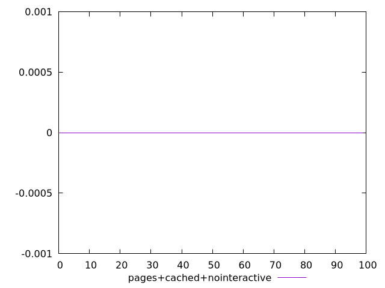
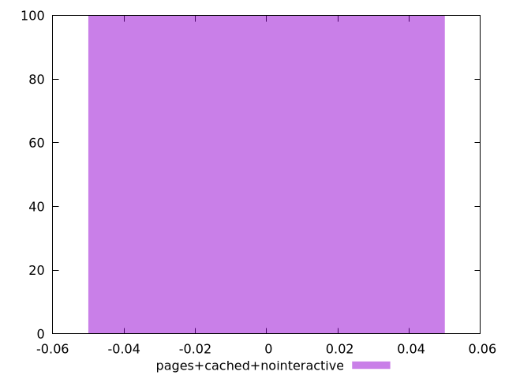
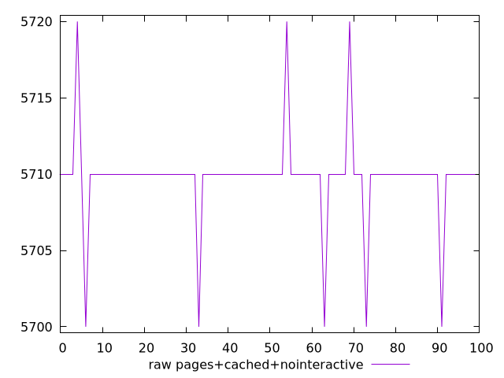
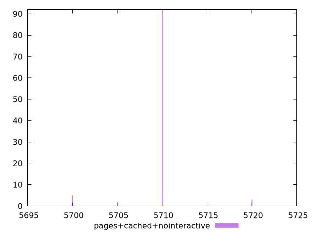

# Report pages+cached+nointeractive

[parent..](./..)  


## Scores

  

## Score Histogram

  

## Score Indicators

```yaml
min: 0
max: 0
range: 0
mean: 0
median: 0
stdev: 0
skewness: .nan
eccentricity: .nan
quanta: 1
quantaRatio: 0.01
p90range: 0
p90stdev: 0
p90eccentricity: .nan
p90quanta: 1
p90quantaRatio: 0.011111111111111112
outlandishness: .nan

```

## Raw Values

  

## Raw Values Histogram

  

## Raw Indicators

```yaml
min: 5700
max: 5720
range: 20
mean: 5709.8
median: 5710
stdev: 2.8213471959331775
skewness: -0.6775336944352955
eccentricity: 0.5671049640067983
quanta: 3
quantaRatio: 0.03
p90range: 0
p90stdev: 5710
p90eccentricity: 0.5671049640067983
p90quanta: 1
p90quantaRatio: 0.011111111111111112
outlandishness: 0.9999299486874351

```

<style>
  img {
    max-width: 80%;
  }
</style>
      
