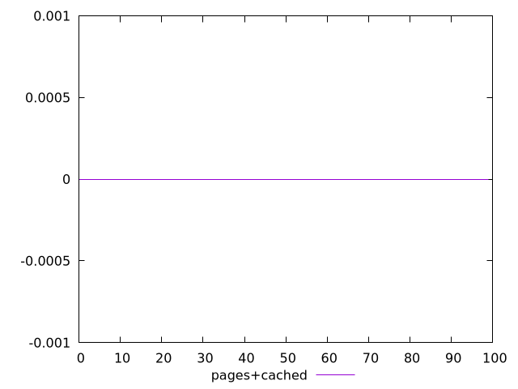

# Report pages+cached

[parent..](./..)  


## Scores

  

## Score Histogram

  

## Score Indicators

```yaml
min: 0
max: 0
range: 0
mean: 0
median: 0
stdev: 0
skewness: .nan
eccentricity: .nan
quanta: 1
quantaRatio: 0.01
p90range: 0
p90stdev: 0
p90eccentricity: .nan
p90quanta: 1
p90quantaRatio: 0.011111111111111112
outlandishness: .nan

```

## Raw Values

  

## Raw Values Histogram

  

## Raw Indicators

```yaml
min: 5700
max: 5850
range: 150
mean: 5710.7
median: 5710
stdev: 16.14032217770141
skewness: 7.178270971394812
eccentricity: 0.4584790761006678
quanta: 5
quantaRatio: 0.05
p90range: 20
p90stdev: 5710
p90eccentricity: 0.4584790761006678
p90quanta: 3
p90quantaRatio: 0.03333333333333333
outlandishness: 1.0004788055484535

```

<style>
  img {
    max-width: 80%;
  }
</style>
      
