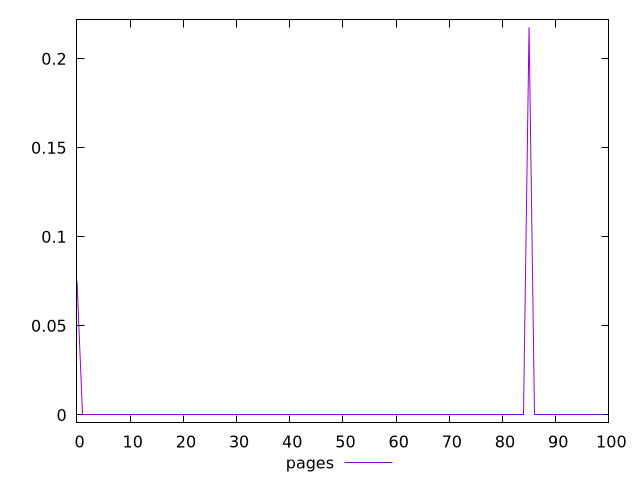
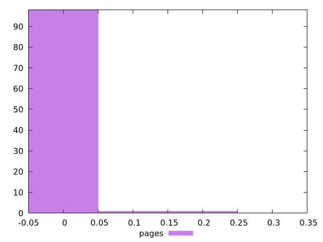
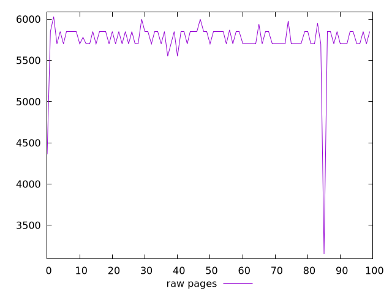
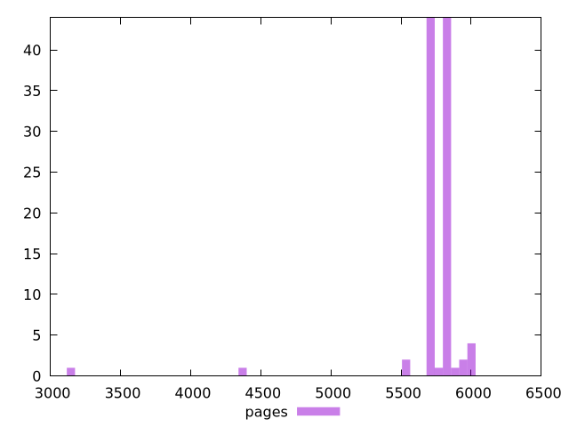

# Report pages

[parent..](./..)  


## Scores

  

## Score Histogram

  

## Score Indicators

```yaml
min: 0
max: 0.21764705882352942
range: 0.21764705882352942
mean: 0.002929411764705882
median: 0
stdev: 0.022843226794405057
skewness: 8.620678270384866
eccentricity: 0.25647968135774724
quanta: 3
quantaRatio: 0.03
p90range: 0
p90stdev: 0
p90eccentricity: 0.25647968135774724
p90quanta: 1
p90quantaRatio: 0.011111111111111112
outlandishness: .inf

```

## Raw Values

  

## Raw Values Histogram

  

## Raw Indicators

```yaml
min: 3150
max: 6030
range: 2880
mean: 5743.6
median: 5850
stdev: 310.8971534125071
skewness: -6.646011102583814
eccentricity: 0.7899718517979816
quanta: 12
quantaRatio: 0.12
p90range: 170
p90stdev: 5815
p90eccentricity: 0.7899718517979816
p90quanta: 4
p90quantaRatio: 0.044444444444444446
outlandishness: 0.9887745871455863

```

<style>
  img {
    max-width: 80%;
  }
</style>
      
