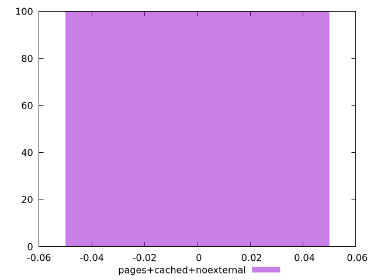

# Report pages+cached+noexternal

[parent..](./..)  


## Scores

  

## Score Histogram

  

## Score Indicators

```yaml
min: 0
max: 0
range: 0
mean: 0
median: 0
stdev: 0
skewness: .nan
eccentricity: .nan
quanta: 1
quantaRatio: 0.01
p90range: 0
p90stdev: 0
p90eccentricity: .nan
p90quanta: 1
p90quantaRatio: 0.011111111111111112
outlandishness: .nan

```

## Raw Values

  

## Raw Values Histogram

  

## Raw Indicators

```yaml
min: 27450
max: 27600
range: 150
mean: 27514.6
median: 27450
stdev: 74.18112967594925
skewness: 0.2822673391674654
eccentricity: 1.7416828317982542
quanta: 3
quantaRatio: 0.03
p90range: 150
p90stdev: 27450
p90eccentricity: 1.7416828317982542
p90quanta: 3
p90quantaRatio: 0.03333333333333333
outlandishness: 1.0006900917883441

```

<style>
  img {
    max-width: 80%;
  }
</style>
      
