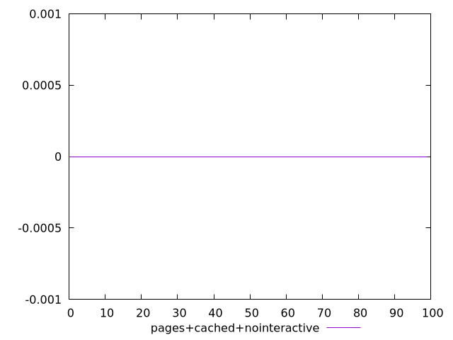
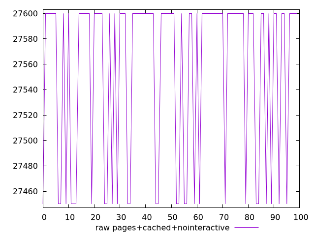
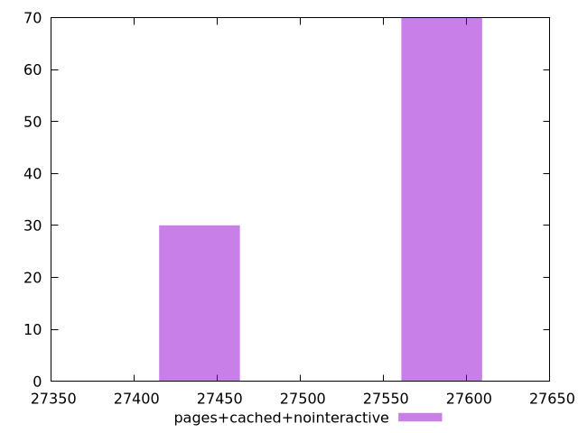

# Report pages+cached+nointeractive

[parent..](./..)  


## Scores

  

## Score Histogram

  

## Score Indicators

```yaml
min: 0
max: 0
range: 0
mean: 0
median: 0
stdev: 0
skewness: .nan
eccentricity: .nan
quanta: 1
quantaRatio: 0.01
p90range: 0
p90stdev: 0
p90eccentricity: .nan
p90quanta: 1
p90quantaRatio: 0.011111111111111112
outlandishness: .nan

```

## Raw Values

  

## Raw Values Histogram

  

## Raw Indicators

```yaml
min: 27450
max: 27600
range: 150
mean: 27555
median: 27600
stdev: 68.7386354243376
skewness: -0.8728715609439683
eccentricity: 1.3093073414159542
quanta: 2
quantaRatio: 0.02
p90range: 150
p90stdev: 27600
p90eccentricity: 1.3093073414159542
p90quanta: 2
p90quantaRatio: 0.022222222222222223
outlandishness: 0.9991537462221955

```

<style>
  img {
    max-width: 80%;
  }
</style>
      
