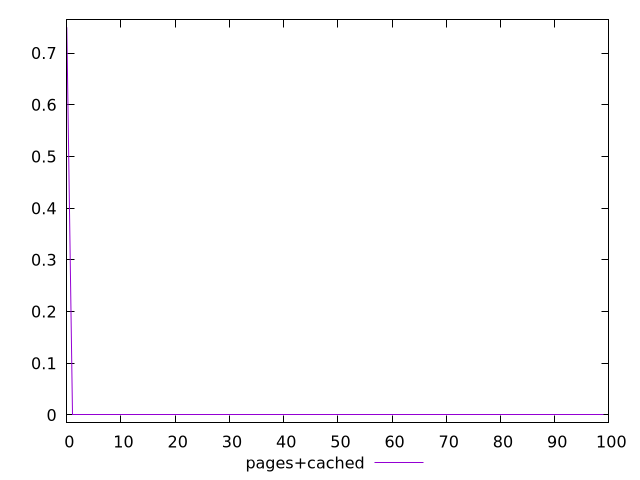
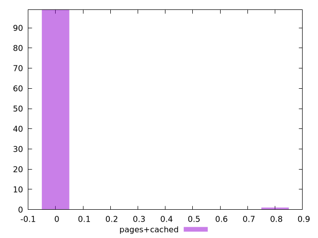
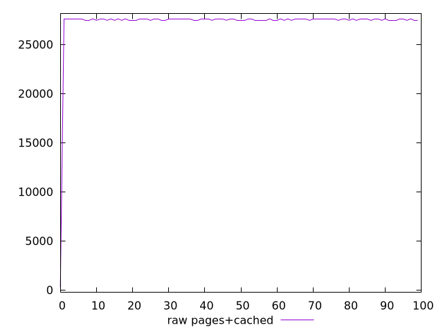
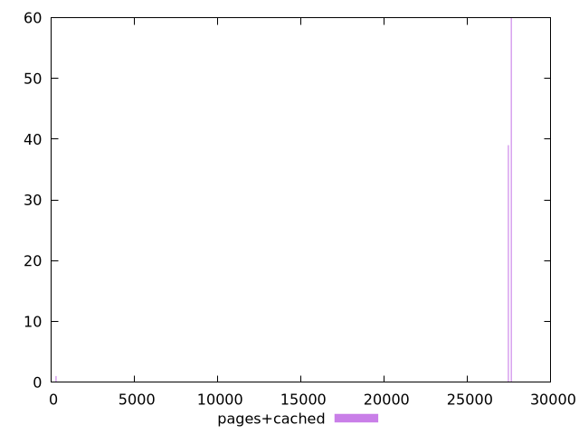

# Report pages+cached

[parent..](./..)  


## Scores

  

## Score Histogram

  

## Score Indicators

```yaml
min: 0
max: 0.75
range: 0.75
mean: 0.0075
median: 0
stdev: 0.07462405778299651
skewness: 9.849370589540312
eccentricity: 0.20100756305184275
quanta: 2
quantaRatio: 0.02
p90range: 0
p90stdev: 0
p90eccentricity: 0.20100756305184275
p90quanta: 1
p90quantaRatio: 0.011111111111111112
outlandishness: .inf

```

## Raw Values

  

## Raw Values Histogram

  

## Raw Indicators

```yaml
min: 300
max: 27600
range: 27300
mean: 27268.6
median: 27600
stdev: 2711.42398750177
skewness: -9.83851089077826
eccentricity: 0.2444471993517637
quanta: 4
quantaRatio: 0.04
p90range: 150
p90stdev: 27600
p90eccentricity: 0.2444471993517637
p90quanta: 3
p90quantaRatio: 0.03333333333333333
outlandishness: 0.9807357714687995

```

<style>
  img {
    max-width: 80%;
  }
</style>
      
