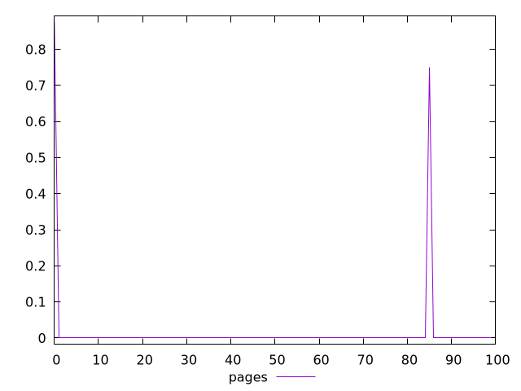
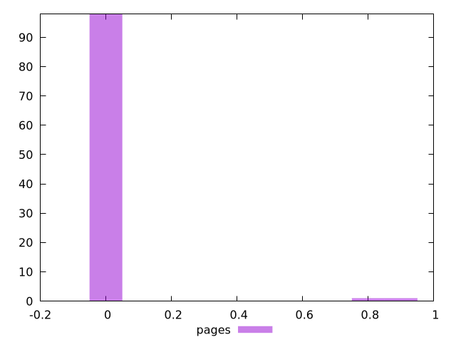
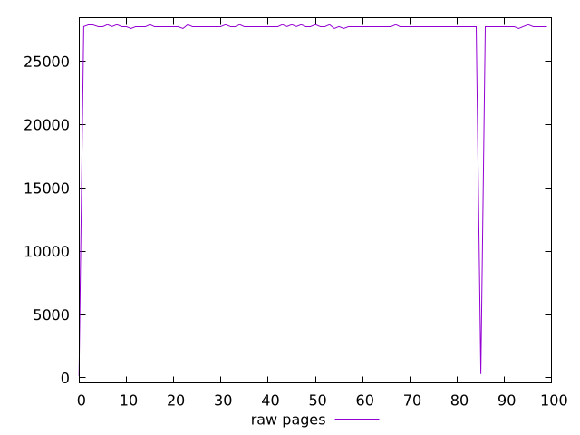
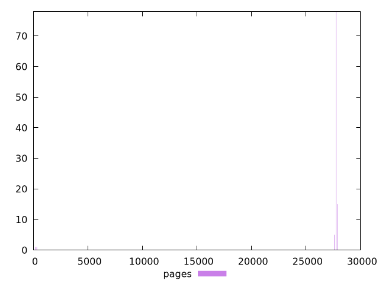

# Report pages

[parent..](./..)  


## Scores

  

## Score Histogram

  

## Score Indicators

```yaml
min: 0
max: 0.875
range: 0.875
mean: 0.01625
median: 0
stdev: 0.11409288978722555
skewness: 6.921160511663917
eccentricity: 0.2848556124804084
quanta: 3
quantaRatio: 0.03
p90range: 0
p90stdev: 0
p90eccentricity: 0.2848556124804084
p90quanta: 1
p90quantaRatio: 0.011111111111111112
outlandishness: .inf

```

## Raw Values

  

## Raw Values Histogram

  

## Raw Indicators

```yaml
min: 150
max: 27900
range: 27750
mean: 27214.5
median: 27750
stdev: 3856.211191052689
skewness: -6.8541448451497935
eccentricity: 0.3010727220266855
quanta: 5
quantaRatio: 0.05
p90range: 300
p90stdev: 27750
p90eccentricity: 0.3010727220266855
p90quanta: 3
p90quantaRatio: 0.03333333333333333
outlandishness: 0.9615467749861532

```

<style>
  img {
    max-width: 80%;
  }
</style>
      
