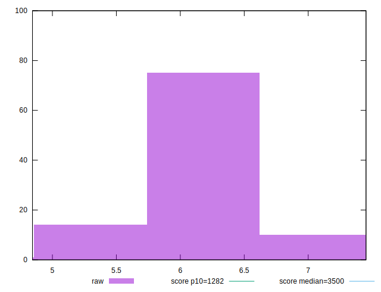
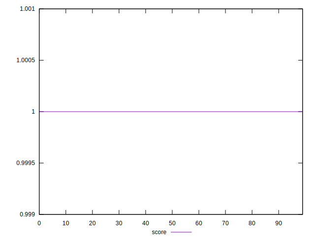
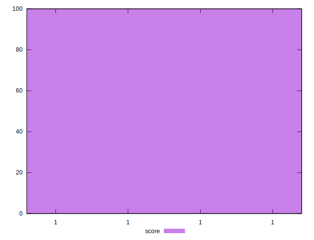

# //bootup-time/samples/empty

[→ Parent](../..)


## Raw


```yaml
p90min: 4.844000000000001
p90max: 6.568
p90range: 1.7239999999999984
p90mean: 5.927599999999999
p90median: 5.886000000000001
p90stdev: 0.3674566278261059
p90skewness: -0.5514123580498714
p90eccentricity: 1
p90discretization: 1.1111111111111112
outlandishness: 1.0366205113878326

```


## Score


```yaml
p90min: 0.9999999999999979
p90max: 0.9999999999999999
p90range: 1.9984014443252818e-15
p90mean: 0.9999999999999999
p90median: 0.9999999999999998
p90stdev: 4.3881517257742663e-16
p90skewness: -2.915492318599345
p90eccentricity: 1.000000000000004
p90discretization: 7.5
outlandishness: 1.0000000000000004

```

