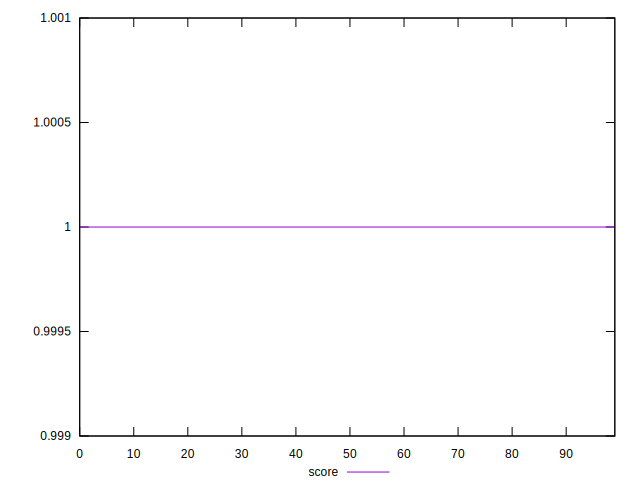

# //bootup-time/samples/empty

[→ Parent](../..)


## Raw


```yaml
p90min: 5.164000000000001
p90max: 6.968000000000001
p90range: 1.8040000000000003
p90mean: 6.017142857142857
p90median: 5.916000000000001
p90stdev: 0.3578388295636529
p90skewness: 0.3291211525912144
p90eccentricity: 0.9999999999999997
p90discretization: 1.1097560975609757
outlandishness: 1.0059975698330366

```


## Score


```yaml
p90min: 0.9999999999999993
p90max: 1
p90range: 6.661338147750939e-16
p90mean: 0.9999999999999999
p90median: 0.9999999999999998
p90stdev: 2.8955752655274886e-16
p90skewness: -1.3472369451068074
p90eccentricity: 0.47819063004846546
p90discretization: 13
outlandishness: 1.0000000000000004

```

