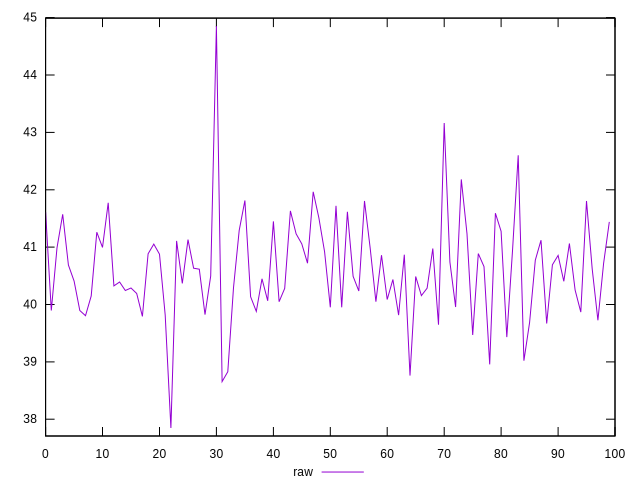
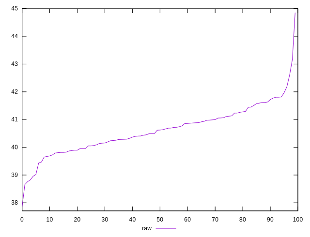
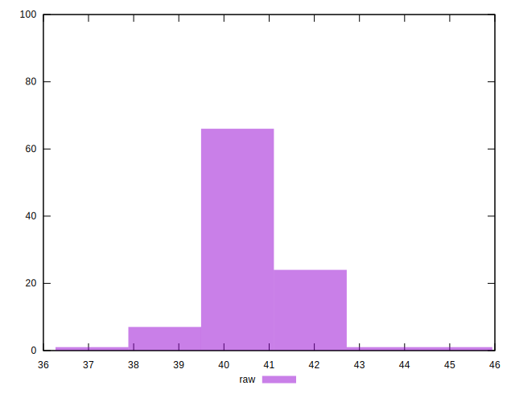
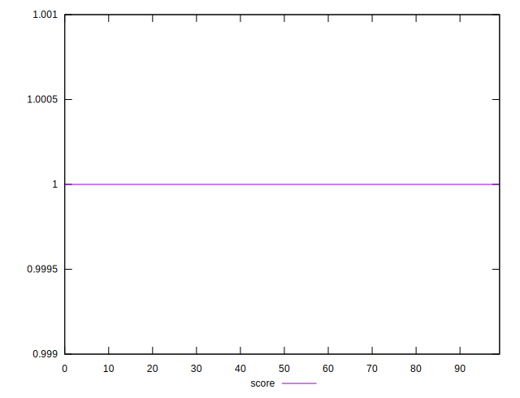
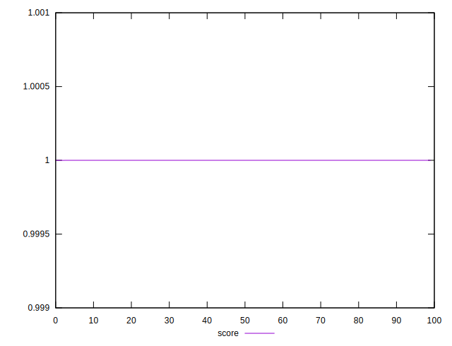
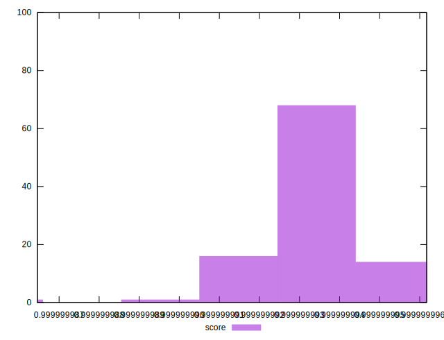

# //bootup-time/samples/pages+cached+noadtech

[→ Parent](../..)


## Raw


```yaml
p90min: 39.43199999999999
p90max: 42.179999999999986
p90range: 2.7479999999999976
p90mean: 40.65134065934065
p90median: 40.63199999999998
p90stdev: 0.6534706702815711
p90skewness: 0.24374184502282667
p90eccentricity: 1
p90discretization: 1
outlandishness: 0.9984370386814269

```


## Score


```yaml
p90min: 0.9999999917036644
p90max: 0.9999999951819467
p90range: 3.478282328828186e-9
p90mean: 0.9999999934523687
p90median: 0.9999999934879893
p90stdev: 7.910923475023614e-10
p90skewness: -0.27765043398663763
p90eccentricity: 1.0000000000000002
p90discretization: 1.0705882352941176
outlandishness: 0.9999999998995726

```


## P Score


```yaml
p90min: 0.9999999917036644
p90max: 0.9999999951819467
p90range: 3.478282328828186e-9
p90mean: 0.9999999934523687
p90median: 0.9999999934879893
p90stdev: 7.910923475023614e-10
p90skewness: -0.27765043398663763
p90eccentricity: 1.0000000000000002
p90discretization: 1.0705882352941176
outlandishness: 0.9999999998995726

```


## Score Difference


```yaml
p90min: 4.818053289668001e-9
p90max: 8.296335618496187e-9
p90range: 3.478282328828186e-9
p90mean: 6.547631184491945e-9
p90median: 6.5120107084482015e-9
p90stdev: 7.910923475023486e-10
p90skewness: 0.2776509706734307
p90eccentricity: 1.0000000000000002
p90discretization: 1.0705882352941176
outlandishness: 1.0153967917222204

```


## P Score Difference


```yaml
p90min: 0
p90max: 0
p90range: 0
p90mean: 0
p90median: 0
p90stdev: 0
p90skewness: .nan
p90eccentricity: .nan
p90discretization: 91
outlandishness: .nan

```

