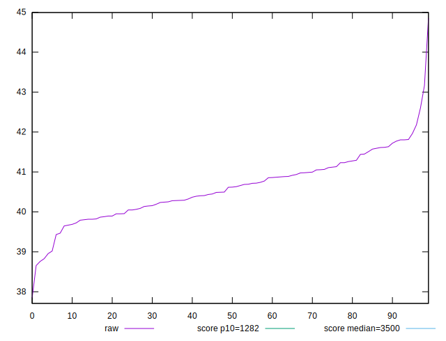
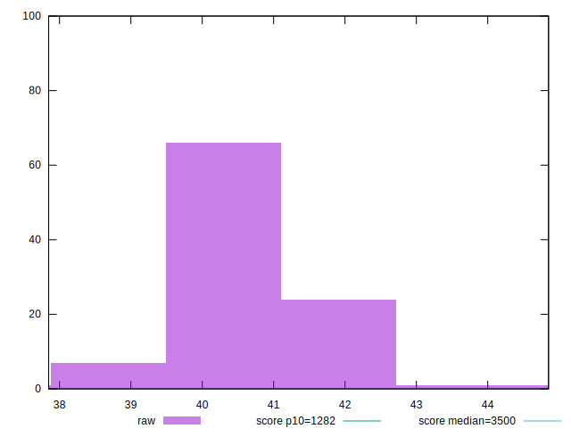

# //bootup-time/samples/pages+cached+noadtech

[→ Parent](../..)


## Raw


```yaml
p90min: 37.848
p90max: 41.632000000000005
p90range: 3.784000000000006
p90mean: 40.425377777777776
p90median: 40.44199999999999
p90stdev: 0.7308973263929724
p90skewness: -0.7195288789954764
p90eccentricity: 1.0000000000000002
p90discretization: 1
outlandishness: 1.0096300199271222

```


## Score


```yaml
p90min: 0.9999999864588494
p90max: 0.9999999945263749
p90range: 8.067525536503695e-9
p90mean: 0.9999999932075745
p90median: 0.9999999933867934
p90stdev: 1.1390203068768617e-9
p90skewness: -2.6957005522497806
p90eccentricity: 1.0000000000001825
p90discretization: 1.0714285714285714
outlandishness: 1.0000000003891611

```

