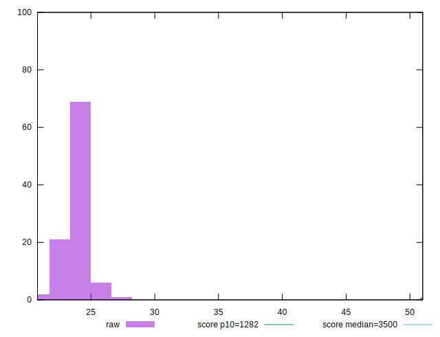
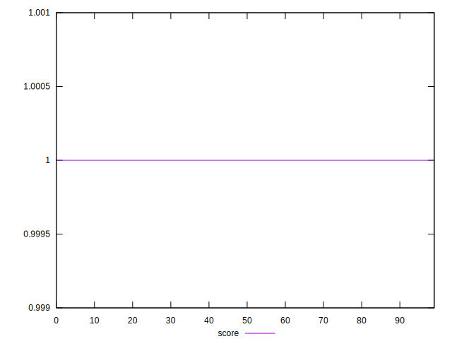

# //bootup-time/samples/pages+cached+noexternal+nocss

[→ Parent](../..)


## Raw


```yaml
p90min: 20.81599999999999
p90max: 24.90399999999999
p90range: 4.088000000000001
p90mean: 23.742311111111107
p90median: 23.733999999999995
p90stdev: 0.7448900238654838
p90skewness: -1.2044588579743072
p90eccentricity: 1.0000000000000004
p90discretization: 1.0112359550561798
outlandishness: 1.0363932294705276

```


## Score


```yaml
p90min: 0.9999999658439884
p90max: 0.999999999929305
p90range: 3.4085316569232305e-8
p90mean: 0.9999999995132904
p90median: 0.9999999998983304
p90stdev: 3.5690573481162927e-9
p90skewness: -9.327032759910361
p90eccentricity: 1.0000000000000135
p90discretization: 1.0843373493975903
outlandishness: 1.0000000000856963

```

