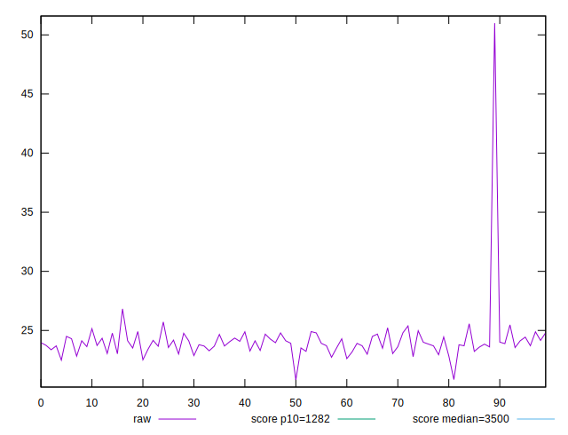
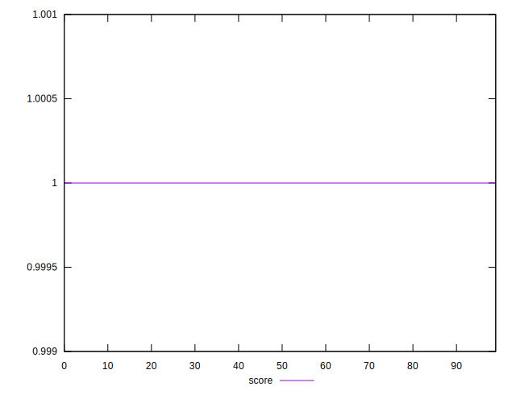

# //bootup-time/samples/pages+cached+noexternal+nocss

[→ Parent](../..)


## Raw


```yaml
p90min: 22.77999999999999
p90max: 25.567999999999994
p90range: 2.788000000000004
p90mean: 23.9723956043956
p90median: 23.90799999999999
p90stdev: 0.6539628123836081
p90skewness: 0.32110237758484245
p90eccentricity: 1.0000000000000002
p90discretization: 1.011111111111111
outlandishness: 1.0165943184481578

```


## Score


```yaml
p90min: 0.999999999743208
p90max: 0.9999999999316445
p90range: 1.8843648863509088e-10
p90mean: 0.9999999998924718
p90median: 0.9999999999000786
p90stdev: 2.949730163175822e-11
p90skewness: -1.8352735730859462
p90eccentricity: 1.000000000226505
p90discretization: 1.0833333333333333
outlandishness: 0.9999999993273336

```

