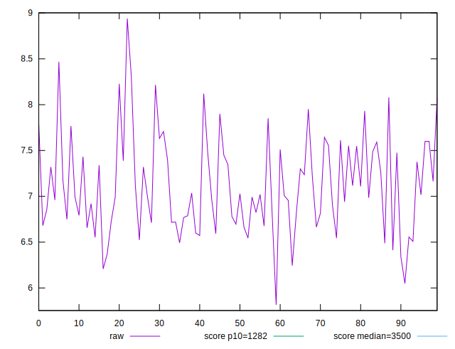
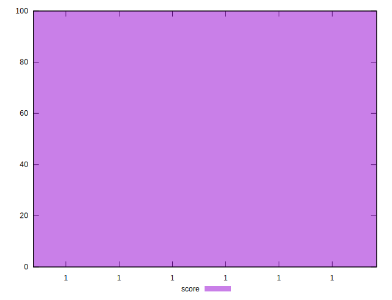

# //bootup-time/samples/pages+cached+noexternal+nofonts+nosvg+noimg+nocss+nojs

[→ Parent](../..)


## Raw


```yaml
p90min: 5.816000000000001
p90max: 7.9
p90range: 2.0839999999999996
p90mean: 7.004222222222221
p90median: 6.988000000000001
p90stdev: 0.43988417106167527
p90skewness: -0.03791459529401635
p90eccentricity: 1.0000000000000004
p90discretization: 1.0588235294117647
outlandishness: 1.035377110456083

```


## Score


```yaml
p90min: 0.9999999999999869
p90max: 0.9999999999999994
p90range: 1.2545520178264269e-14
p90mean: 0.9999999999999984
p90median: 0.9999999999999987
p90stdev: 2.3934684997118292e-15
p90skewness: -2.8304088495089768
p90eccentricity: 0.6256185899734622
p90discretization: 2.903225806451613
outlandishness: 1.0000000000000013

```

