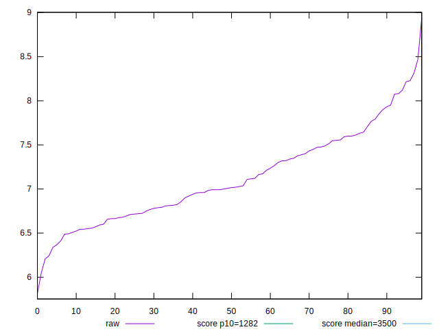
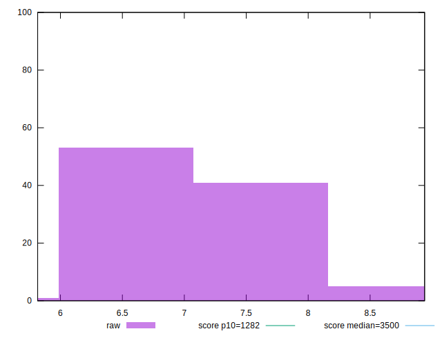

# //bootup-time/samples/pages+cached+noexternal+nofonts+nosvg+noimg+nocss+nojs

[→ Parent](../..)


## Raw


```yaml
p90min: 6.208000000000002
p90max: 8.076
p90range: 1.8679999999999986
p90mean: 7.0601758241758255
p90median: 6.992000000000002
p90stdev: 0.4411704361142571
p90skewness: 0.27562129125822177
p90eccentricity: 0.9999999999999997
p90discretization: 1.058139534883721
outlandishness: 1.0190309136153433

```


## Score


```yaml
p90min: 0.999999999999996
p90max: 0.9999999999999998
p90range: 3.774758283725532e-15
p90mean: 0.9999999999999992
p90median: 0.9999999999999989
p90stdev: 1.1165491329479315e-15
p90skewness: -1.8710207045195006
p90eccentricity: 0.8860278139939155
p90discretization: 3.5
outlandishness: 0.9999999999999996

```

