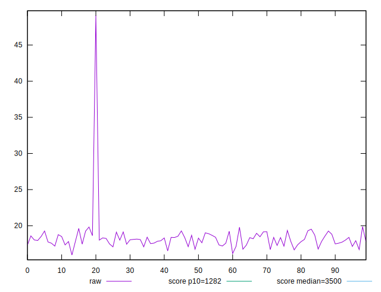
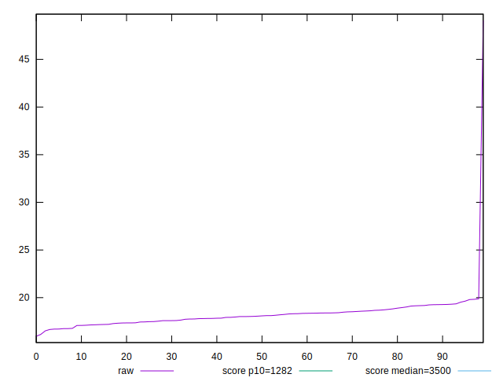
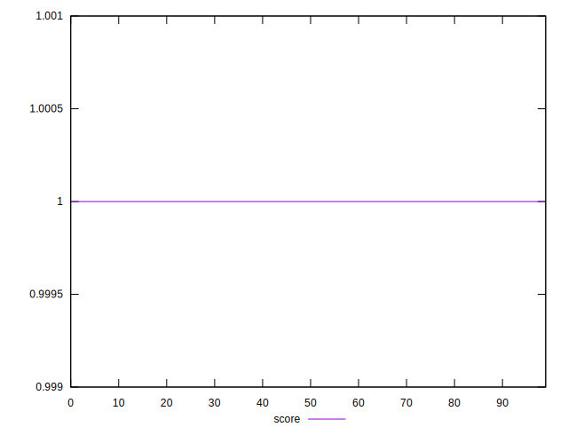

# //bootup-time/samples/pages+cached+noexternal+nofonts+nosvg+noimg+nocss

[→ Parent](../..)


## Raw


```yaml
p90min: 15.947999999999993
p90max: 19.267999999999994
p90range: 3.3200000000000003
p90mean: 17.92857777777777
p90median: 17.987999999999992
p90stdev: 0.7434831086443774
p90skewness: -0.2628467878370645
p90eccentricity: 0.9999999999999993
p90discretization: 1.0344827586206897
outlandishness: 1.0516094661068933

```


## Score


```yaml
p90min: 0.9999999739957541
p90max: 0.9999999999944157
p90range: 2.599866155694741e-8
p90mean: 0.9999999997007123
p90median: 0.999999999990165
p90stdev: 2.7247227301892205e-9
p90skewness: -9.327954622451552
p90eccentricity: 1.0000000000000027
p90discretization: 1.0588235294117647
outlandishness: 1.0000000000589813

```

