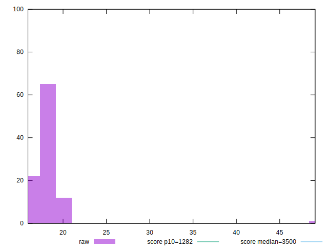
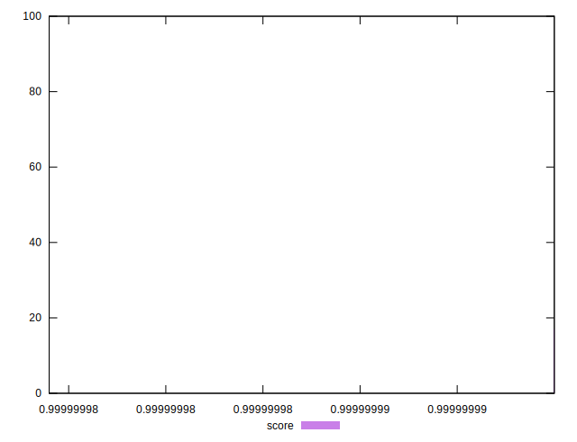

# //bootup-time/samples/pages+cached+noexternal+nofonts+nosvg+noimg+nocss

[→ Parent](../..)


## Raw


```yaml
p90min: 16.77599999999999
p90max: 19.879999999999995
p90range: 3.1040000000000063
p90mean: 18.211912087912083
p90median: 18.151999999999994
p90stdev: 0.7404086731396897
p90skewness: 0.30718865434883214
p90eccentricity: 1.0000000000000002
p90discretization: 1.0340909090909092
outlandishness: 1.0191428818749155

```


## Score


```yaml
p90min: 0.999999999979055
p90max: 0.9999999999952467
p90range: 1.6191714635738208e-11
p90mean: 0.9999999999896492
p90median: 0.9999999999904817
p90stdev: 3.807955634013587e-12
p90skewness: -0.8659762941164436
p90eccentricity: 1.0000000008126704
p90discretization: 1.058139534883721
outlandishness: 0.9999999994811075

```


## P Score


```yaml
p90min: 0.999999999979055
p90max: 0.9999999999952467
p90range: 1.6191714635738208e-11
p90mean: 0.9999999999896492
p90median: 0.9999999999904817
p90stdev: 3.807955634013587e-12
p90skewness: -0.8659762941164436
p90eccentricity: 1.0000000008126704
p90discretization: 1.058139534883721
outlandishness: 0.9999999994811075

```


## Score Difference


```yaml
p90min: 4.753308857630145e-12
p90max: 2.0945023493368353e-11
p90range: 1.6191714635738208e-11
p90mean: 1.035101552700583e-11
p90median: 9.518275057018855e-12
p90stdev: 3.807955631104642e-12
p90skewness: 0.8660935583025758
p90eccentricity: 0.9999999999999999
p90discretization: 1.058139534883721
outlandishness: 679.373891865172

```


## P Score Difference


```yaml
p90min: 0
p90max: 0
p90range: 0
p90mean: 0
p90median: 0
p90stdev: 0
p90skewness: .nan
p90eccentricity: .nan
p90discretization: 91
outlandishness: .nan

```

