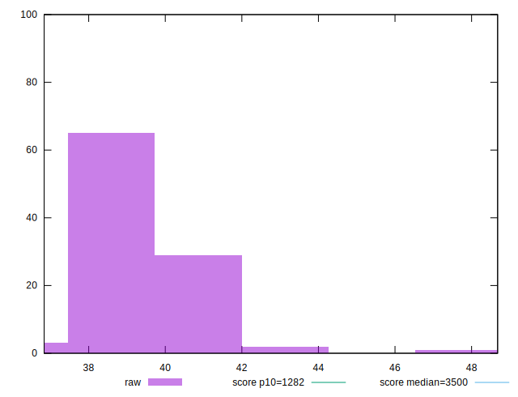

# //bootup-time/samples/pages+cached+noexternal+nofonts+nosvg+noimg

[→ Parent](../..)


## Raw


```yaml
p90min: 36.83599999999999
p90max: 40.72799999999999
p90range: 3.891999999999996
p90mean: 38.96733333333333
p90median: 38.97999999999999
p90stdev: 0.9060043168893962
p90skewness: -0.16528547435547977
p90eccentricity: 0.9999999999999997
p90discretization: 1.0227272727272727
outlandishness: 1.0178697546590032

```


## Score


```yaml
p90min: 0.9999999754924316
p90max: 0.9999999962521773
p90range: 2.0759745700260623e-8
p90mean: 0.9999999944823876
p90median: 0.9999999948590022
p90stdev: 2.3735045272362587e-9
p90skewness: -5.923515898857342
p90eccentricity: 1.0000000000000608
p90discretization: 1.0465116279069768
outlandishness: 1.0000000003952199

```

