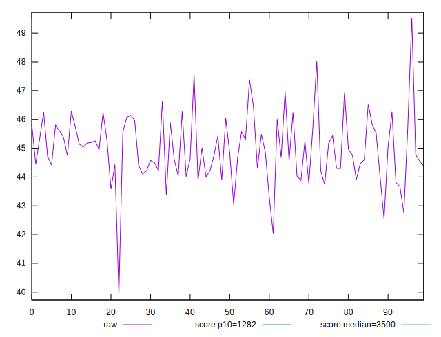
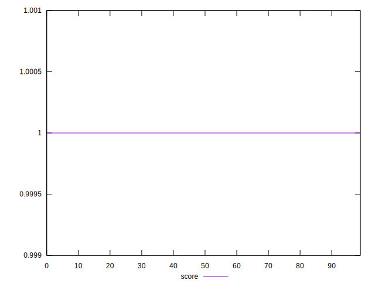
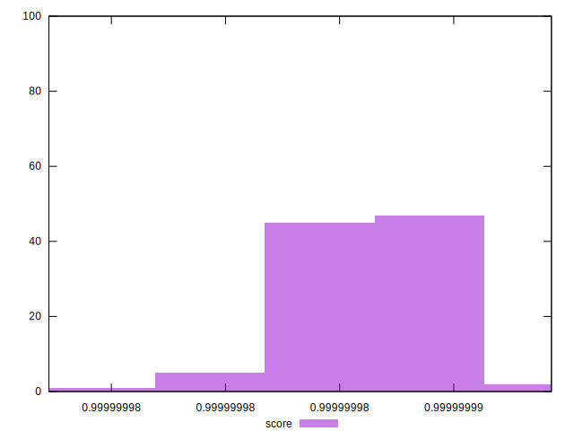

# //bootup-time/samples/pages+cached+noexternal+nofonts

[→ Parent](../..)


## Raw


```yaml
p90min: 43.036
p90max: 46.93199999999999
p90range: 3.8959999999999866
p90mean: 44.94567032967034
p90median: 44.84399999999999
p90stdev: 0.8681485801702021
p90skewness: 0.14269893360257757
p90eccentricity: 1.0000000000000002
p90discretization: 1.0224719101123596
outlandishness: 1.0009867530205165

```


## Score


```yaml
p90min: 0.9999999820140912
p90max: 0.9999999904793507
p90range: 8.46525949338428e-9
p90mean: 0.9999999862384311
p90median: 0.9999999866344085
p90stdev: 1.949334977156399e-9
p90skewness: -0.21739942446183222
p90eccentricity: 1.0000000000000013
p90discretization: 1.0340909090909092
outlandishness: 0.9999999994377335

```

