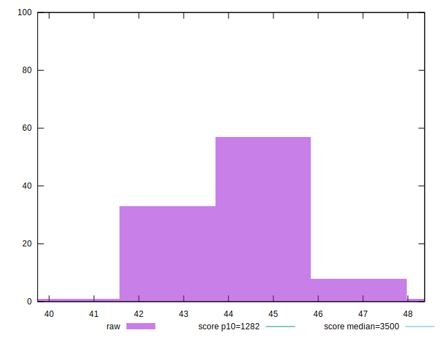
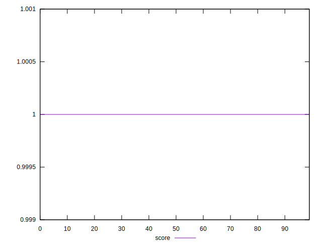

# //bootup-time/samples/pages+cached+noexternal+noimg

[→ Parent](../..)


## Raw


```yaml
p90min: 39.74399999999999
p90max: 45.73599999999999
p90range: 5.991999999999997
p90mean: 43.99475555555558
p90median: 44.05199999999999
p90stdev: 0.9530611535830916
p90skewness: -0.8967050289323016
p90eccentricity: 0.9999999999999999
p90discretization: 1.0112359550561798
outlandishness: 1.0112164485816422

```


## Score


```yaml
p90min: 0.9999999765848036
p90max: 0.999999990118572
p90range: 1.353376843926668e-8
p90mean: 0.9999999871623648
p90median: 0.9999999875458659
p90stdev: 2.3066437830676143e-9
p90skewness: -1.5440373139327022
p90eccentricity: 1.000000000000009
p90discretization: 1.0588235294117647
outlandishness: 1.0000000007794476

```

