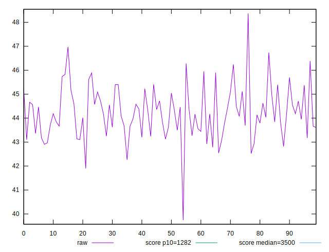
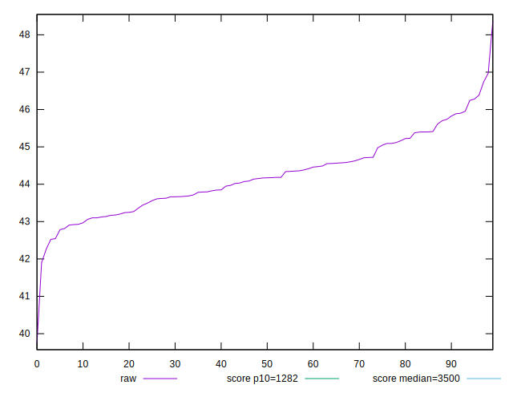

# //bootup-time/samples/pages+cached+noexternal+noimg

[→ Parent](../..)


## Raw


```yaml
p90min: 42.524
p90max: 45.95199999999999
p90range: 3.42799999999999
p90mean: 44.16690109890111
p90median: 44.15199999999999
p90stdev: 0.8642952417686014
p90skewness: 0.2230567043072755
p90eccentricity: 1.0000000000000004
p90discretization: 1.011111111111111
outlandishness: 1.0033491470812186

```


## Score


```yaml
p90min: 0.9999999839756177
p90max: 0.9999999912602215
p90range: 7.284603809054602e-9
p90mean: 0.9999999878786026
p90median: 0.9999999879637894
p90stdev: 1.7571228610677642e-9
p90skewness: -0.3760002422643423
p90eccentricity: 1.0000000000000624
p90discretization: 1.058139534883721
outlandishness: 0.9999999993469721

```


## P Score


```yaml
p90min: 0.9999999839756177
p90max: 0.9999999912602215
p90range: 7.284603809054602e-9
p90mean: 0.9999999878786026
p90median: 0.9999999879637894
p90stdev: 1.7571228610677642e-9
p90skewness: -0.3760002422643423
p90eccentricity: 1.0000000000000624
p90discretization: 1.058139534883721
outlandishness: 0.9999999993469721

```


## Score Difference


```yaml
p90min: 8.739778456501313e-9
p90max: 1.6024382265555914e-8
p90range: 7.284603809054602e-9
p90mean: 1.212139798668498e-8
p90median: 1.2036210583765694e-8
p90stdev: 1.757122861067735e-9
p90skewness: 0.3759996902710212
p90eccentricity: 1.0000000000000004
p90discretization: 1.058139534883721
outlandishness: 1.0545995290099286

```


## P Score Difference


```yaml
p90min: 0
p90max: 0
p90range: 0
p90mean: 0
p90median: 0
p90stdev: 0
p90skewness: .nan
p90eccentricity: .nan
p90discretization: 91
outlandishness: .nan

```

