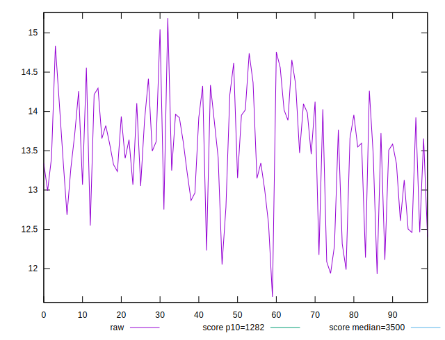
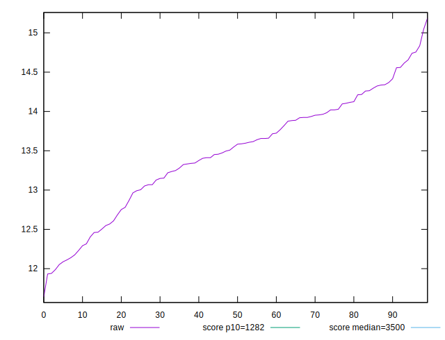
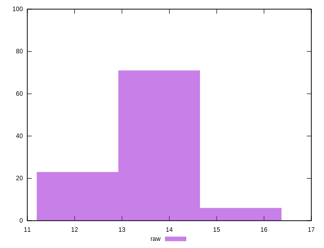
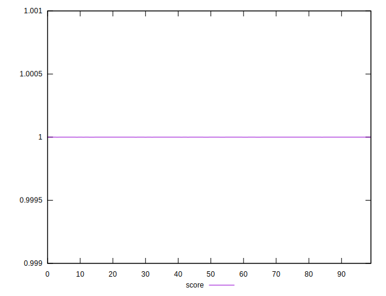
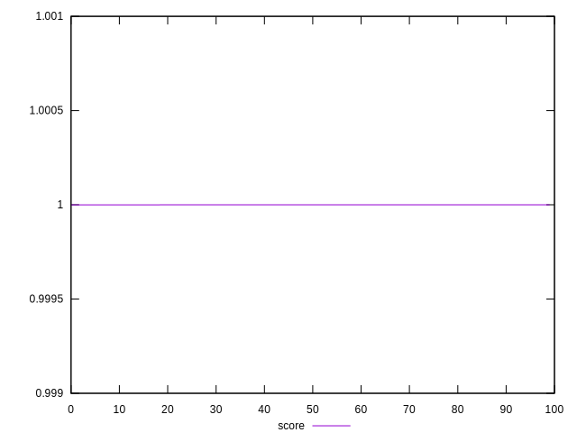

# //bootup-time/samples/pages+cached+noexternal+nojs

[→ Parent](../..)


## Raw


```yaml
p90min: 12.112
p90max: 14.755999999999998
p90range: 2.6439999999999984
p90mean: 13.523164835164836
p90median: 13.588
p90stdev: 0.6659071027798584
p90skewness: -0.31250849727427116
p90eccentricity: 1.0000000000000002
p90discretization: 1.0224719101123596
outlandishness: 0.9926182393084513

```


## Score


```yaml
p90min: 0.9999999999987841
p90max: 0.999999999999833
p90range: 1.048938713665848e-12
p90mean: 0.9999999999993424
p90median: 0.9999999999993536
p90stdev: 2.805533781174093e-13
p90skewness: -0.10134333169465172
p90eccentricity: 1.0000005110983887
p90discretization: 1.058139534883721
outlandishness: 0.9999999999998426

```


## P Score


```yaml
p90min: 0.9999999999987841
p90max: 0.999999999999833
p90range: 1.048938713665848e-12
p90mean: 0.9999999999993424
p90median: 0.9999999999993536
p90stdev: 2.805533781174093e-13
p90skewness: -0.10134333169465172
p90eccentricity: 1.0000005110983887
p90discretization: 1.058139534883721
outlandishness: 0.9999999999998426

```


## Score Difference


```yaml
p90min: 1.6697754290362354e-13
p90max: 1.2159162565694714e-12
p90range: 1.048938713665848e-12
p90mean: 6.578120221916124e-13
p90median: 6.463718449367661e-13
p90stdev: 2.8055335803893546e-13
p90skewness: 0.10247834831196542
p90eccentricity: 1.0000000000000002
p90discretization: 1.058139534883721
outlandishness: 1.2526542786525028

```


## P Score Difference


```yaml
p90min: 0
p90max: 0
p90range: 0
p90mean: 0
p90median: 0
p90stdev: 0
p90skewness: .nan
p90eccentricity: .nan
p90discretization: 91
outlandishness: .nan

```

