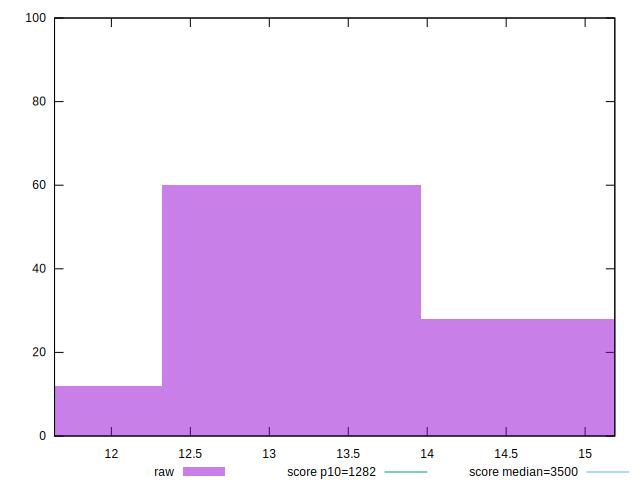
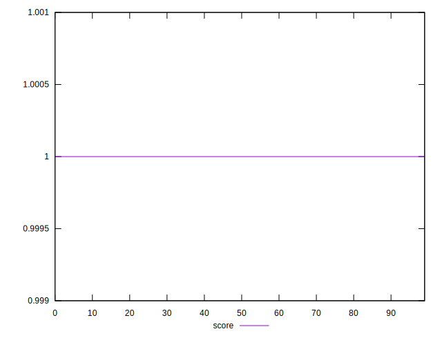
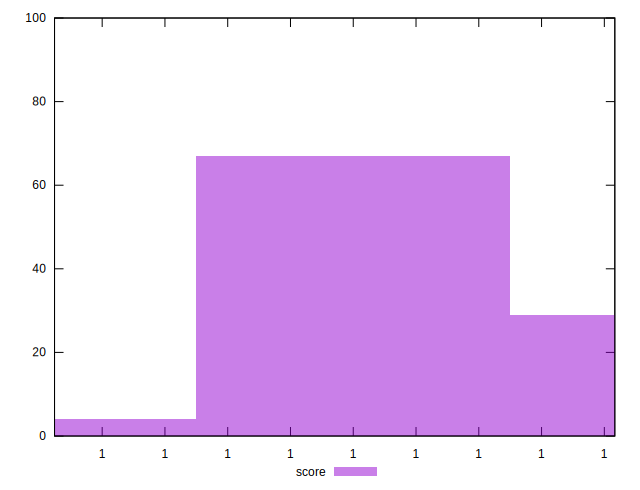

# //bootup-time/samples/pages+cached+noexternal+nojs

[→ Parent](../..)


## Raw


```yaml
p90min: 11.64
p90max: 14.368000000000002
p90range: 2.7280000000000015
p90mean: 13.332755555555552
p90median: 13.454
p90stdev: 0.6979135621600383
p90skewness: -0.5403010542980199
p90eccentricity: 1
p90discretization: 1.0227272727272727
outlandishness: 1.0211724768661274

```


## Score


```yaml
p90min: 0.9999999999980482
p90max: 0.9999999999997212
p90range: 1.6729950758076484e-12
p90mean: 0.9999999999992076
p90median: 0.9999999999992734
p90stdev: 3.477820688443016e-13
p90skewness: -0.8892209982621447
p90eccentricity: 1.0000002174026361
p90discretization: 1.0588235294117647
outlandishness: 1.0000000000001124

```

