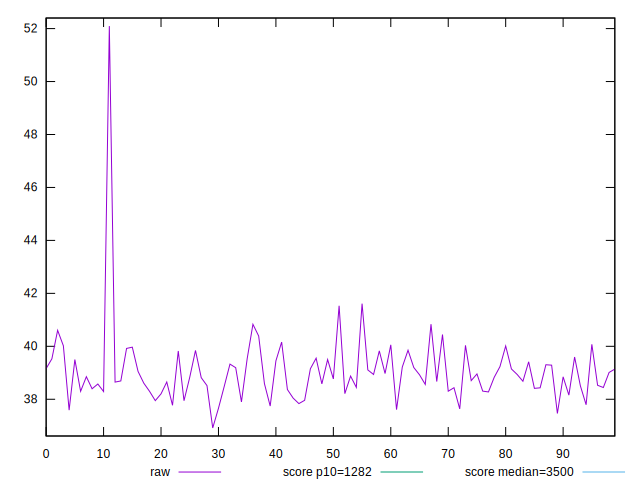
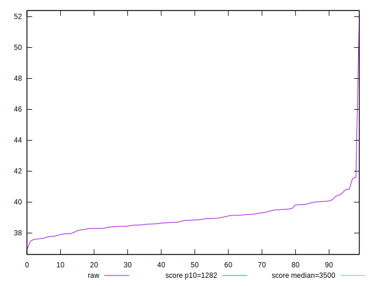
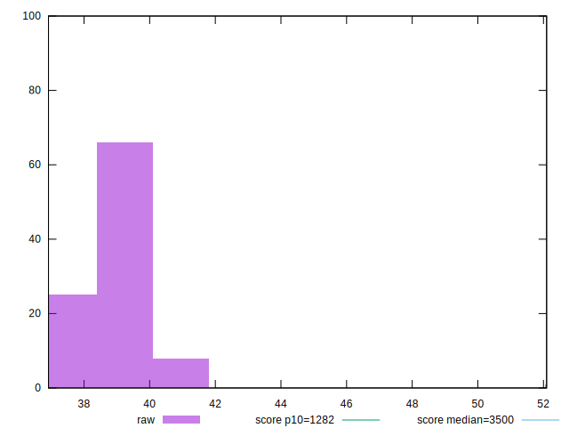
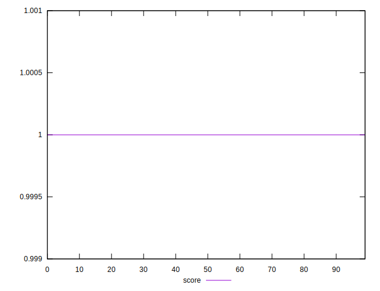

# //bootup-time/samples/pages+cached+noexternal+nosvg

[→ Parent](../..)


## Raw


```yaml
p90min: 37.608
p90max: 40.44399999999998
p90range: 2.8359999999999843
p90mean: 38.87595604395603
p90median: 38.82799999999999
p90stdev: 0.6916792738315102
p90skewness: 0.26197358077758426
p90eccentricity: 1
p90discretization: 1.011111111111111
outlandishness: 1.0101069081582814

```


## Score


```yaml
p90min: 0.9999999935071144
p90max: 0.9999999963327442
p90range: 2.8256297301965105e-9
p90mean: 0.9999999952473645
p90median: 0.9999999953540804
p90stdev: 6.572436032295585e-10
p90skewness: -0.562494095522316
p90eccentricity: 1.0000000000002507
p90discretization: 1.0340909090909092
outlandishness: 0.9999999992006212

```

