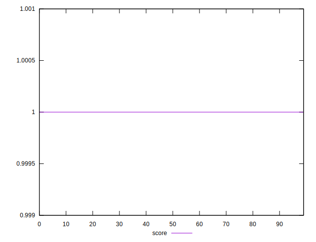

# //bootup-time/samples/pages+cached+noexternal+nosvg

[→ Parent](../..)


## Raw


```yaml
p90min: 36.91599999999999
p90max: 40.056
p90range: 3.1400000000000077
p90mean: 38.76235555555555
p90median: 38.69799999999999
p90stdev: 0.6834125858287471
p90skewness: -0.04496897637526091
p90eccentricity: 1.0000000000000009
p90discretization: 1.0112359550561798
outlandishness: 1.016036206461217

```


## Score


```yaml
p90min: 0.9999999602657192
p90max: 0.99999999613318
p90range: 3.586746077921532e-8
p90mean: 0.999999994680281
p90median: 0.9999999952595073
p90stdev: 3.732691015491516e-9
p90skewness: -8.705651584639737
p90eccentricity: 1
p90discretization: 1.0344827586206897
outlandishness: 1.0000000003347882

```

