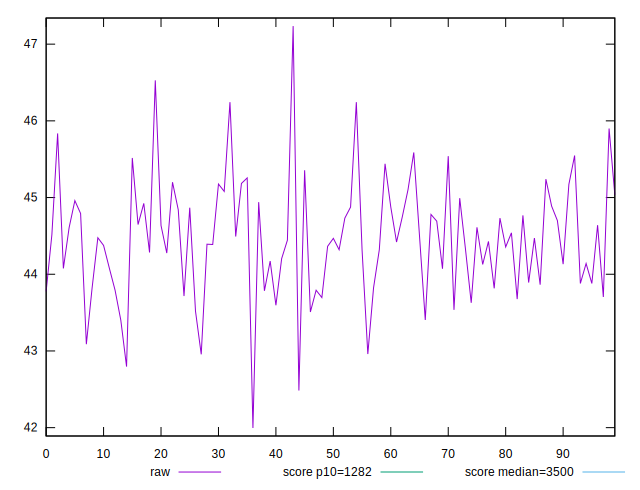
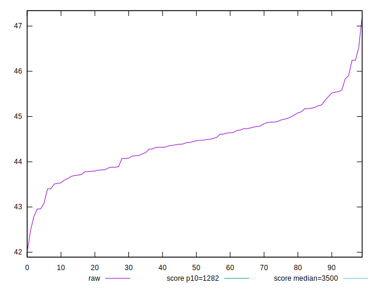

# //bootup-time/samples/pages+cached+noexternal

[→ Parent](../..)


## Raw


```yaml
p90min: 43.08799999999999
p90max: 45.899999999999984
p90range: 2.8119999999999976
p90mean: 44.466945054945064
p90median: 44.46799999999999
p90stdev: 0.6073657290703622
p90skewness: 0.11686244499780185
p90eccentricity: 1.0000000000000009
p90discretization: 1.011111111111111
outlandishness: 0.9996588743383971

```


## Score


```yaml
p90min: 0.9999999847515679
p90max: 0.9999999901389105
p90range: 5.387342572049647e-9
p90mean: 0.9999999873669527
p90median: 0.9999999873678488
p90stdev: 1.260648005969959e-9
p90skewness: -0.012945870993023988
p90eccentricity: 1.0000000000000024
p90discretization: 1.058139534883721
outlandishness: 0.9999999996706936

```

