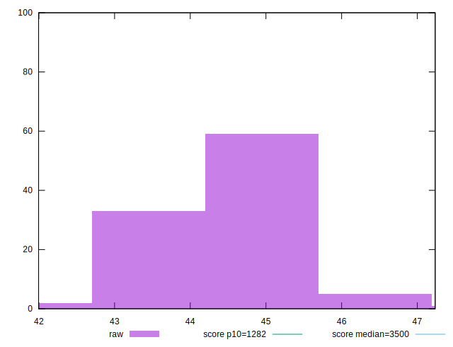

# //bootup-time/samples/pages+cached+noexternal

[→ Parent](../..)


## Raw


```yaml
p90min: 41.99599999999999
p90max: 45.44
p90range: 3.4440000000000097
p90mean: 44.28617777777777
p90median: 44.38199999999999
p90stdev: 0.6617026283724904
p90skewness: -0.7941335133280814
p90eccentricity: 1.0000000000000002
p90discretization: 1.0112359550561798
outlandishness: 1.0078363429705177

```


## Score


```yaml
p90min: 0.9999999802708532
p90max: 0.9999999891149604
p90range: 8.84410711332606e-9
p90mean: 0.999999986889353
p90median: 0.9999999872045463
p90stdev: 1.5722609758495193e-9
p90skewness: -1.3617865477882265
p90eccentricity: 0.9999999999999997
p90discretization: 1.0714285714285714
outlandishness: 1.0000000006258931

```

