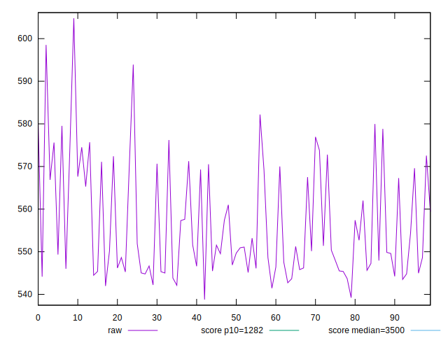
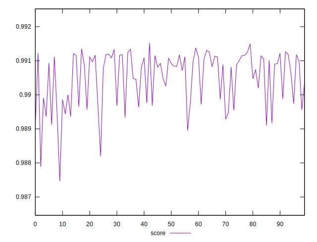
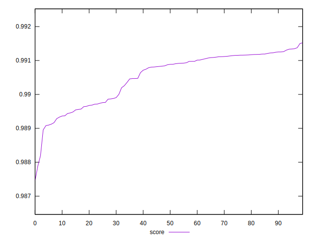

# //bootup-time/samples/pages+cached+nointeractive

[→ Parent](../..)


## Raw


```yaml
p90min: 538.7760000000001
p90max: 575.6960000000004
p90range: 36.9200000000003
p90mean: 553.6212000000005
p90median: 549.5700000000003
p90stdev: 10.76076530033479
p90skewness: 0.7940599257631982
p90eccentricity: 0.9999999999999999
p90discretization: 1
outlandishness: 1.0114090894679333

```


## Score


```yaml
p90min: 0.9874616336868934
p90max: 0.9912440097129516
p90range: 0.003782376026058132
p90mean: 0.9903890238839959
p90median: 0.9908131612699954
p90stdev: 0.0008464753650046273
p90skewness: -1.093718719427205
p90eccentricity: 0.9999999999999999
p90discretization: 1
outlandishness: 1.0001939218438927

```

