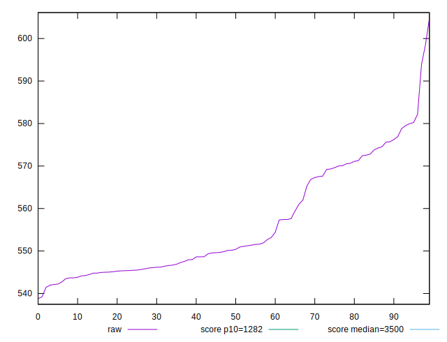
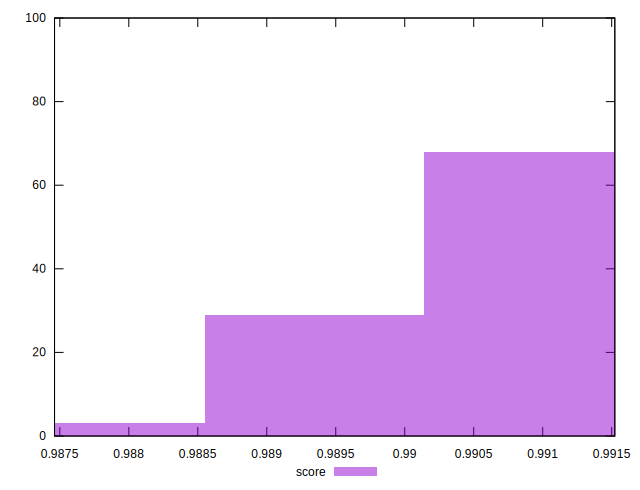

# //bootup-time/samples/pages+cached+nointeractive

[→ Parent](../..)


## Raw


```yaml
p90min: 538.7760000000001
p90max: 576.2159999999999
p90range: 37.43999999999983
p90mean: 553.8694945054949
p90median: 549.6000000000003
p90stdev: 10.957651302817853
p90skewness: 0.7721131779957865
p90eccentricity: 1
p90discretization: 1
outlandishness: 1.0105024822862765

```


## Score


```yaml
p90min: 0.9893316091404485
p90max: 0.991522837869242
p90range: 0.002191228728793515
p90mean: 0.9906621542290173
p90median: 0.9909194234625365
p90stdev: 0.0006427386497522999
p90skewness: -0.8016996267259779
p90eccentricity: 1.0000000000000004
p90discretization: 1
outlandishness: 0.9996424812729258

```

