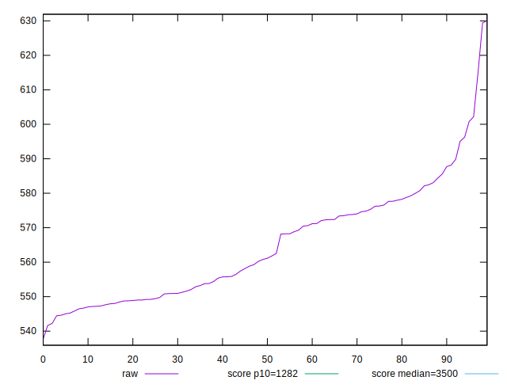
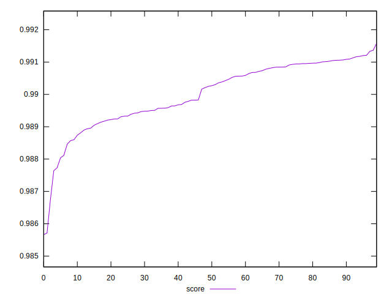

# //bootup-time/samples/pages+cached

[→ Parent](../..)


## Raw


```yaml
p90min: 537.7520000000004
p90max: 585.5720000000005
p90range: 47.82000000000005
p90mean: 561.0498222222222
p90median: 557.8020000000001
p90stdev: 12.971595815968055
p90skewness: 0.2304278539223418
p90eccentricity: 1.0000000000000004
p90discretization: 1
outlandishness: 1.0151777323004127

```


## Score


```yaml
p90min: 0.9856639742075987
p90max: 0.9910652404010927
p90range: 0.005401266193494014
p90mean: 0.9898250931457109
p90median: 0.9898229959133937
p90stdev: 0.0011201370785199182
p90skewness: -1.383164126401971
p90eccentricity: 1.0000000000000009
p90discretization: 1
outlandishness: 1.0002847196993014

```

