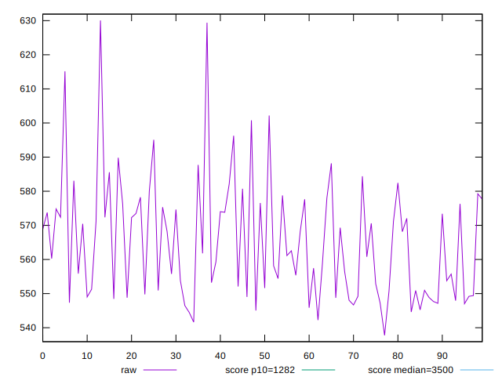

# //bootup-time/samples/pages+cached

[→ Parent](../..)


## Raw


```yaml
p90min: 541.6320000000003
p90max: 588.1720000000005
p90range: 46.54000000000019
p90mean: 561.8969670329673
p90median: 558.8520000000003
p90stdev: 13.252585344663705
p90skewness: 0.2651384352170461
p90eccentricity: 0.9999999999999992
p90discretization: 1
outlandishness: 1.0121189713308707

```


## Score


```yaml
p90min: 0.9885700010691848
p90max: 0.9913659879407442
p90range: 0.0027959868715593528
p90mean: 0.9901858766887691
p90median: 0.9903842903602412
p90stdev: 0.0007928066463616084
p90skewness: -0.3059008560909772
p90eccentricity: 0.9999999999999996
p90discretization: 1
outlandishness: 0.999555926191777

```

